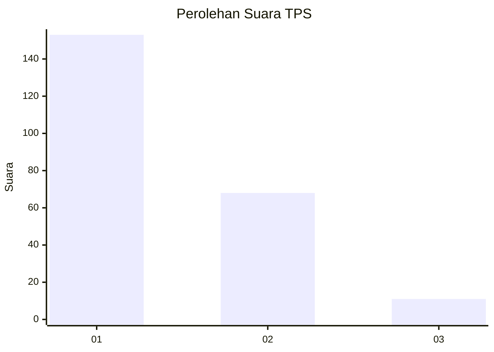
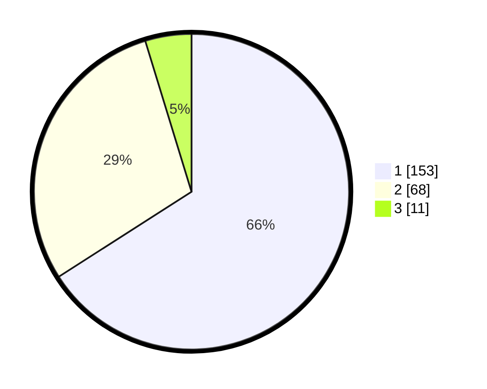

# Hasil

## Grafik

## Tabel

| No. | Nama Paslon    | Suara | Suara (raw) | Persentase |
|:--- |:-------------- | -----:| -----------:| ----------:|
| 1   | ANIES MUHAIMIN | 153   | [153][p-1]  | 65,95      |
| 2   | PRABOWO GIBRAN | 68    | [68][p-2]   | 29,31      |
| 3   | GANJAR MAHFUD  | 11    | [11][p-3]   | 4,74       |

[p-1]: https://github.com/gigit-pemilu/pemilu-2024-14-riau/blob/main/pilpres/hitung-suara/sub/14-riau/sub/71-kota-pekanbaru/sub/13-tuahmadani/sub/1002-sialangmunggu/sub/023-tps/sub/paslon-1.txt
[p-2]: https://github.com/gigit-pemilu/pemilu-2024-14-riau/blob/main/pilpres/hitung-suara/sub/14-riau/sub/71-kota-pekanbaru/sub/13-tuahmadani/sub/1002-sialangmunggu/sub/023-tps/sub/paslon-2.txt
[p-3]: https://github.com/gigit-pemilu/pemilu-2024-14-riau/blob/main/pilpres/hitung-suara/sub/14-riau/sub/71-kota-pekanbaru/sub/13-tuahmadani/sub/1002-sialangmunggu/sub/023-tps/sub/paslon-3.txt

## Foto C Plano

https://sirekap-obj-formc.kpu.go.id/b03f/pemilu/ppwp/14/71/13/10/02/1471131002023-20240214-194831--202b250c-7cac-4db0-8eea-a337ba4d970d.jpg

https://sirekap-obj-formc.kpu.go.id/b03f/pemilu/ppwp/14/71/13/10/02/1471131002023-20240214-195205--94aec9b5-aa90-4ed4-bf66-6621b383ea5f.jpg

https://sirekap-obj-formc.kpu.go.id/b03f/pemilu/ppwp/14/71/13/10/02/1471131002023-20240214-195319--ffa53395-3251-482a-a5d5-1f4c75374113.jpg

## Metadata

| Key        | Value               |
| ---------- | ------------------- |
| Time Stamp | 2024-02-15 12:00:28 |

