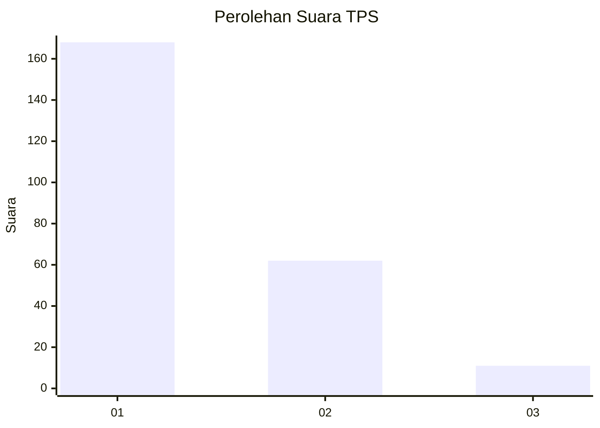
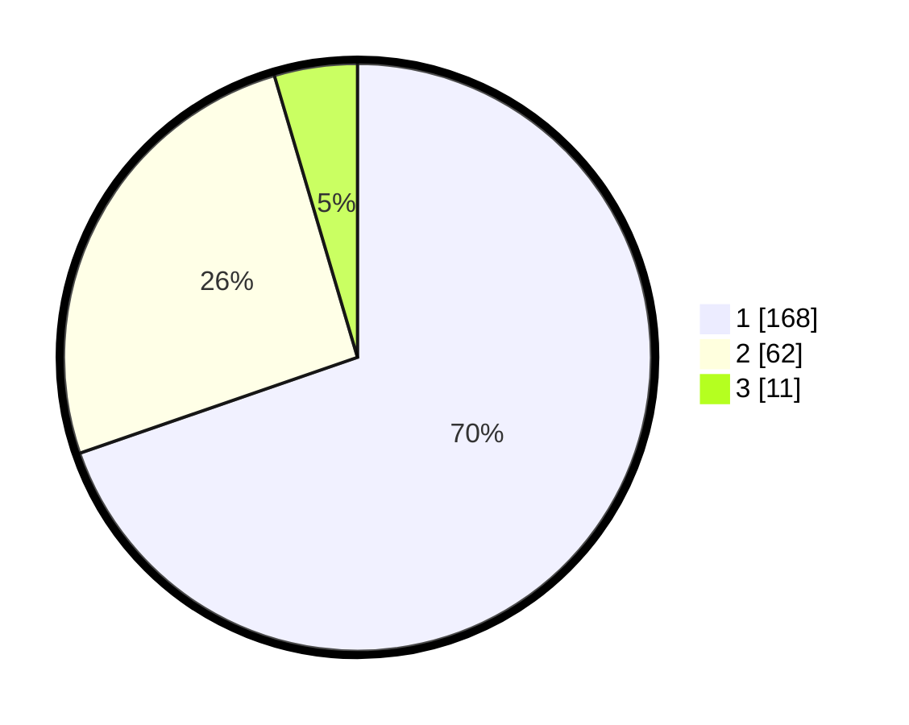

# Hasil

## Grafik

## Tabel

| No. | Nama Paslon    | Suara | Suara (raw) | Persentase |
|:--- |:-------------- | -----:| -----------:| ----------:|
| 1   | ANIES MUHAIMIN | 168   | [168][p-1]  | 69,71      |
| 2   | PRABOWO GIBRAN | 62    | [62][p-2]   | 25,73      |
| 3   | GANJAR MAHFUD  | 11    | [11][p-3]   | 4,56       |

[p-1]: https://github.com/gigit-pemilu/pemilu-2024-14-riau/blob/main/pilpres/hitung-suara/sub/14-riau/sub/71-kota-pekanbaru/sub/13-tuahmadani/sub/1002-sialangmunggu/sub/083-tps/sub/paslon-1.txt
[p-2]: https://github.com/gigit-pemilu/pemilu-2024-14-riau/blob/main/pilpres/hitung-suara/sub/14-riau/sub/71-kota-pekanbaru/sub/13-tuahmadani/sub/1002-sialangmunggu/sub/083-tps/sub/paslon-2.txt
[p-3]: https://github.com/gigit-pemilu/pemilu-2024-14-riau/blob/main/pilpres/hitung-suara/sub/14-riau/sub/71-kota-pekanbaru/sub/13-tuahmadani/sub/1002-sialangmunggu/sub/083-tps/sub/paslon-3.txt

## Foto C Plano

https://sirekap-obj-formc.kpu.go.id/17db/pemilu/ppwp/14/71/13/10/02/1471131002083-20240214-222424--fbc15b49-319b-400a-beb1-e8a74d94a672.jpg

https://sirekap-obj-formc.kpu.go.id/17db/pemilu/ppwp/14/71/13/10/02/1471131002083-20240214-222535--f3669a89-46e4-4476-843e-46b09a86acf4.jpg

https://sirekap-obj-formc.kpu.go.id/17db/pemilu/ppwp/14/71/13/10/02/1471131002083-20240214-222632--508a5cc5-a7fd-4e31-ba32-355ae2bd7a74.jpg

## Metadata

| Key        | Value               |
| ---------- | ------------------- |
| Time Stamp | 2024-02-15 16:30:25 |

