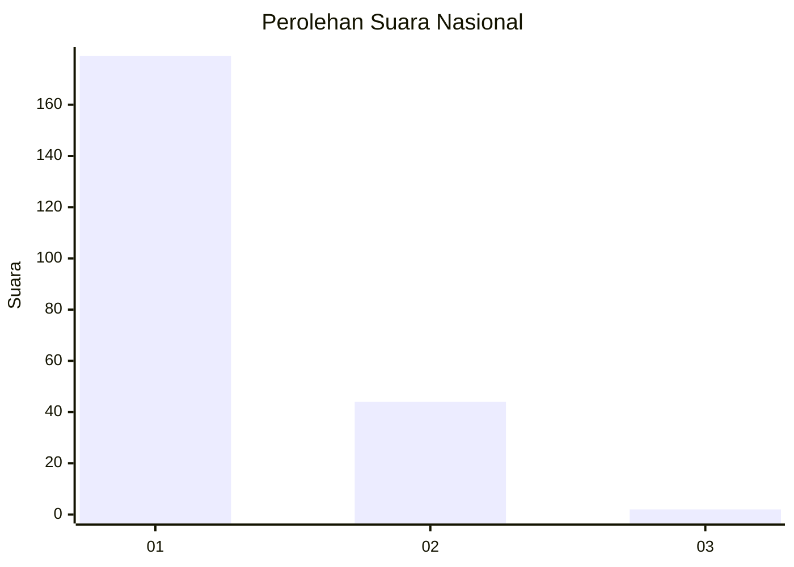
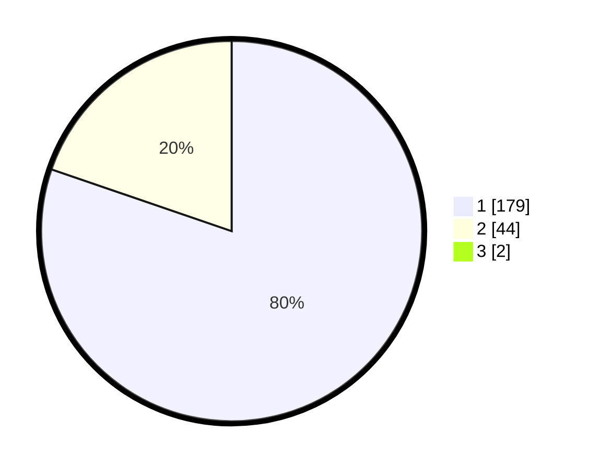

# Hasil

## Grafik

## Tabel

| No. | Nama Paslon    | Suara | Suara (raw) | Persentase |
|:--- |:-------------- | -----:| -----------:| ----------:|
| 1   | ANIES MUHAIMIN | 179   | [179][p-1]  | 79,56      |
| 2   | PRABOWO GIBRAN | 44    | [44][p-2]   | 19,56      |
| 3   | GANJAR MAHFUD  | 2     | [2][p-3]    | 0,89       |

[p-1]: https://github.com/gigit-pemilu/pemilu-2024/blob/main/pilpres/hitung-suara/sub/14-riau/sub/71-kota-pekanbaru/sub/13-tuahmadani/sub/1003-tuahkarya/sub/049-tps/sub/paslon-1.txt
[p-2]: https://github.com/gigit-pemilu/pemilu-2024/blob/main/pilpres/hitung-suara/sub/14-riau/sub/71-kota-pekanbaru/sub/13-tuahmadani/sub/1003-tuahkarya/sub/049-tps/sub/paslon-2.txt
[p-3]: https://github.com/gigit-pemilu/pemilu-2024/blob/main/pilpres/hitung-suara/sub/14-riau/sub/71-kota-pekanbaru/sub/13-tuahmadani/sub/1003-tuahkarya/sub/049-tps/sub/paslon-3.txt

## Foto C Plano

https://sirekap-obj-formc.kpu.go.id/3d2a/pemilu/ppwp/14/71/13/10/03/1471131003049-20240214-194113--1cca7de8-6a06-4b75-9fb5-faf94f33aad4.jpg

https://sirekap-obj-formc.kpu.go.id/3d2a/pemilu/ppwp/14/71/13/10/03/1471131003049-20240214-194101--31788f62-f6f9-43a8-bbf9-f2ebcaedaf99.jpg

https://sirekap-obj-formc.kpu.go.id/3d2a/pemilu/ppwp/14/71/13/10/03/1471131003049-20240214-193851--8b0da163-94de-457d-9ad8-b371117f46f2.jpg

## Metadata

| Key        | Value               |
| ---------- | ------------------- |
| Time Stamp | 2024-02-15 12:00:28 |

