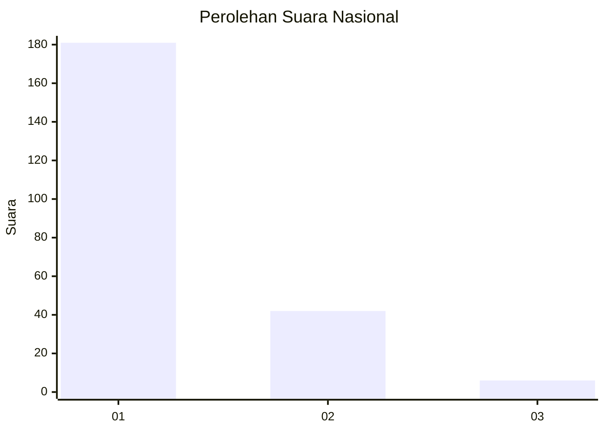
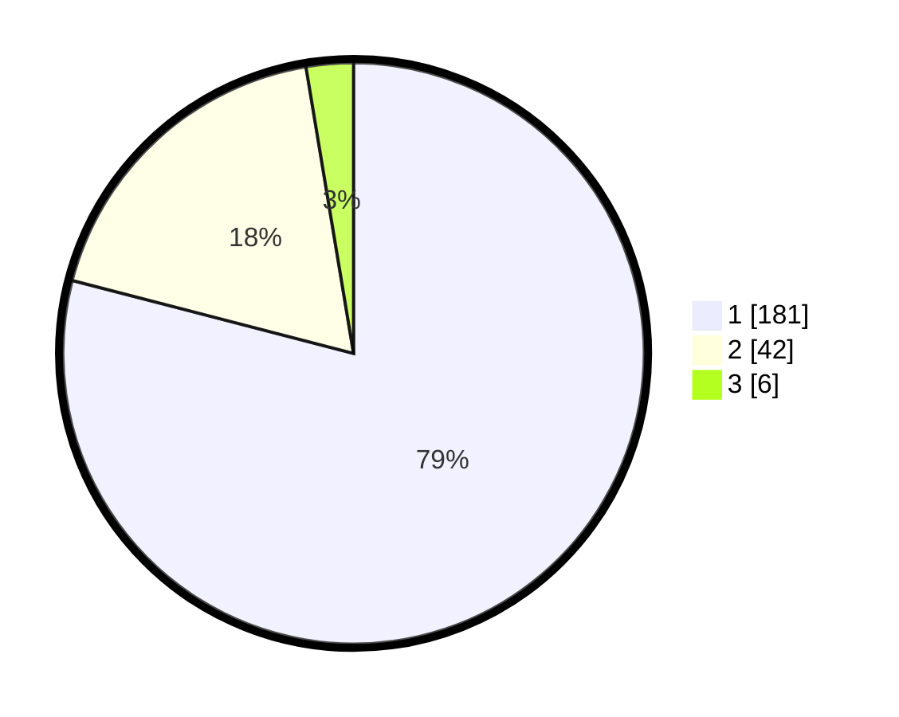

# Hasil

## Grafik

## Tabel

| No. | Nama Paslon    | Suara | Suara (raw) | Persentase |
|:--- |:-------------- | -----:| -----------:| ----------:|
| 1   | ANIES MUHAIMIN | 181   | [181][p-1]  | 79,04      |
| 2   | PRABOWO GIBRAN | 42    | [42][p-2]   | 18,34      |
| 3   | GANJAR MAHFUD  | 6     | [6][p-3]    | 2,62       |

[p-1]: https://github.com/gigit-pemilu/pemilu-2024/blob/main/pilpres/hitung-suara/sub/14-riau/sub/71-kota-pekanbaru/sub/13-tuahmadani/sub/1003-tuahkarya/sub/070-tps/sub/paslon-1.txt
[p-2]: https://github.com/gigit-pemilu/pemilu-2024/blob/main/pilpres/hitung-suara/sub/14-riau/sub/71-kota-pekanbaru/sub/13-tuahmadani/sub/1003-tuahkarya/sub/070-tps/sub/paslon-2.txt
[p-3]: https://github.com/gigit-pemilu/pemilu-2024/blob/main/pilpres/hitung-suara/sub/14-riau/sub/71-kota-pekanbaru/sub/13-tuahmadani/sub/1003-tuahkarya/sub/070-tps/sub/paslon-3.txt

## Foto C Plano

https://sirekap-obj-formc.kpu.go.id/c32b/pemilu/ppwp/14/71/13/10/03/1471131003070-20240215-032155--50f4a95e-1c8d-422b-baa5-dbe9f7296e68.jpg

https://sirekap-obj-formc.kpu.go.id/c32b/pemilu/ppwp/14/71/13/10/03/1471131003070-20240215-032235--3591a36f-f8cc-4c10-8712-d572bc4b9e47.jpg

https://sirekap-obj-formc.kpu.go.id/c32b/pemilu/ppwp/14/71/13/10/03/1471131003070-20240215-032319--d7f213ae-1193-4f99-8a09-134f88753f60.jpg

## Metadata

| Key        | Value               |
| ---------- | ------------------- |
| Time Stamp | 2024-02-15 21:30:27 |

