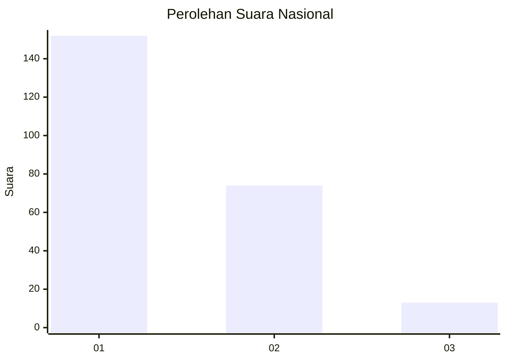
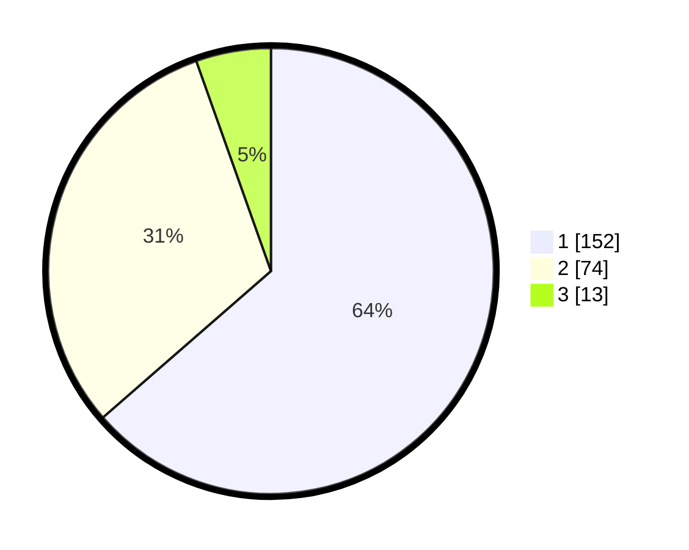

# Hasil

## Grafik

## Tabel

| No. | Nama Paslon    | Suara | Suara (raw) | Persentase |
|:--- |:-------------- | -----:| -----------:| ----------:|
| 1   | ANIES MUHAIMIN | 152   | [152][p-1]  | 63,60      |
| 2   | PRABOWO GIBRAN | 74    | [74][p-2]   | 30,96      |
| 3   | GANJAR MAHFUD  | 13    | [13][p-3]   | 5,44       |

[p-1]: https://github.com/gigit-pemilu/pemilu-2024/blob/main/pilpres/hitung-suara/sub/14-riau/sub/71-kota-pekanbaru/sub/13-tuahmadani/sub/1004-tuahmadani/sub/008-tps/sub/paslon-1.txt
[p-2]: https://github.com/gigit-pemilu/pemilu-2024/blob/main/pilpres/hitung-suara/sub/14-riau/sub/71-kota-pekanbaru/sub/13-tuahmadani/sub/1004-tuahmadani/sub/008-tps/sub/paslon-2.txt
[p-3]: https://github.com/gigit-pemilu/pemilu-2024/blob/main/pilpres/hitung-suara/sub/14-riau/sub/71-kota-pekanbaru/sub/13-tuahmadani/sub/1004-tuahmadani/sub/008-tps/sub/paslon-3.txt

## Foto C Plano

https://sirekap-obj-formc.kpu.go.id/376b/pemilu/ppwp/14/71/13/10/04/1471131004008-20240215-011948--95d062af-84aa-4857-9ccc-c874560b0b0f.jpg

https://sirekap-obj-formc.kpu.go.id/376b/pemilu/ppwp/14/71/13/10/04/1471131004008-20240215-012119--4303d8e5-4cdc-482d-899d-02243053511e.jpg

https://sirekap-obj-formc.kpu.go.id/376b/pemilu/ppwp/14/71/13/10/04/1471131004008-20240215-012229--2fbf4abc-23aa-415e-b454-3e12373fcd57.jpg

## Metadata

| Key        | Value               |
| ---------- | ------------------- |
| Time Stamp | 2024-02-15 17:00:25 |

