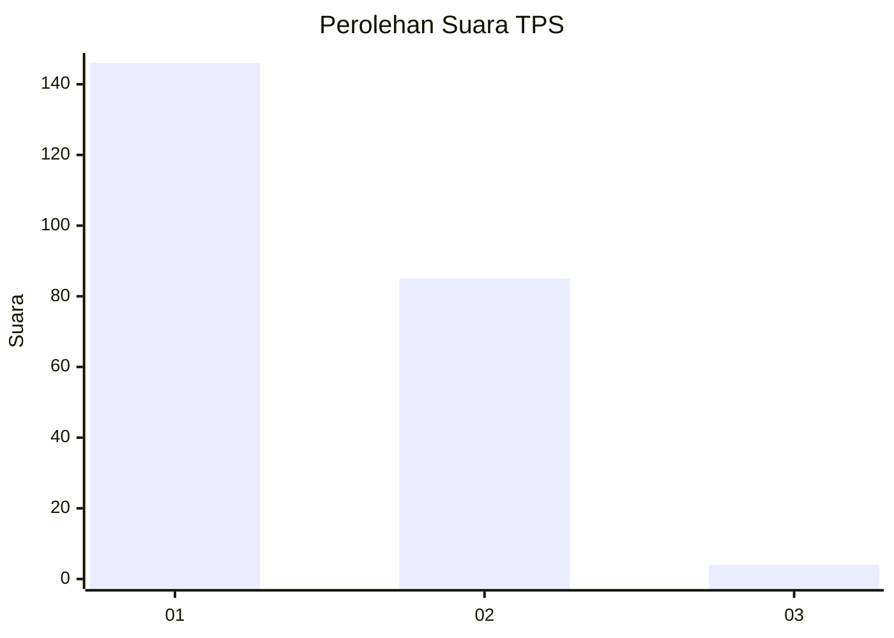
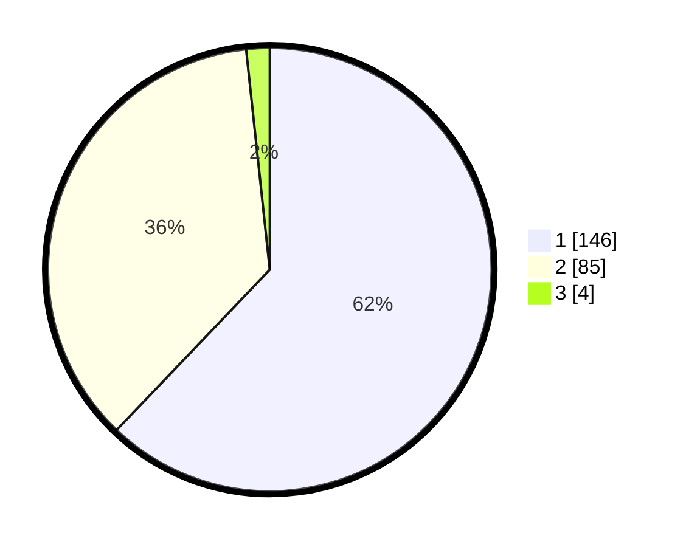

# Hasil

## Grafik

## Tabel

| No. | Nama Paslon    | Suara | Suara (raw) | Persentase |
|:--- |:-------------- | -----:| -----------:| ----------:|
| 1   | ANIES MUHAIMIN | 146   | [146][p-1]  | 62,13      |
| 2   | PRABOWO GIBRAN | 85    | [85][p-2]   | 36,17      |
| 3   | GANJAR MAHFUD  | 4     | [4][p-3]    | 1,70       |

[p-1]: https://github.com/gigit-pemilu/pemilu-2024-14-riau/blob/main/pilpres/hitung-suara/sub/14-riau/sub/71-kota-pekanbaru/sub/13-tuahmadani/sub/1004-tuahmadani/sub/015-tps/sub/paslon-1.txt
[p-2]: https://github.com/gigit-pemilu/pemilu-2024-14-riau/blob/main/pilpres/hitung-suara/sub/14-riau/sub/71-kota-pekanbaru/sub/13-tuahmadani/sub/1004-tuahmadani/sub/015-tps/sub/paslon-2.txt
[p-3]: https://github.com/gigit-pemilu/pemilu-2024-14-riau/blob/main/pilpres/hitung-suara/sub/14-riau/sub/71-kota-pekanbaru/sub/13-tuahmadani/sub/1004-tuahmadani/sub/015-tps/sub/paslon-3.txt

## Foto C Plano

https://sirekap-obj-formc.kpu.go.id/bd10/pemilu/ppwp/14/71/13/10/04/1471131004015-20240215-034809--aadb9cff-0f3d-4469-bfd6-c5335f905252.jpg

https://sirekap-obj-formc.kpu.go.id/bd10/pemilu/ppwp/14/71/13/10/04/1471131004015-20240215-034910--6bb8bc18-3f14-49d0-aecd-eb75c5abfd3d.jpg

https://sirekap-obj-formc.kpu.go.id/bd10/pemilu/ppwp/14/71/13/10/04/1471131004015-20240215-035011--ba90956d-23fa-4068-b7dd-eb7b754dfef9.jpg

## Metadata

| Key        | Value               |
| ---------- | ------------------- |
| Time Stamp | 2024-02-15 17:00:25 |

