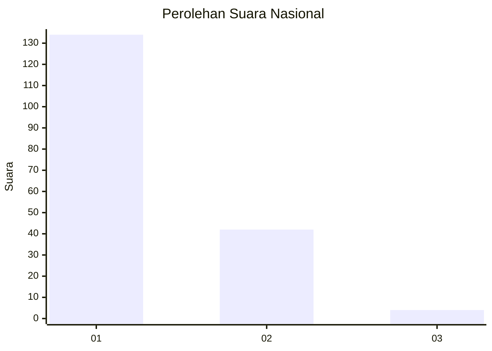
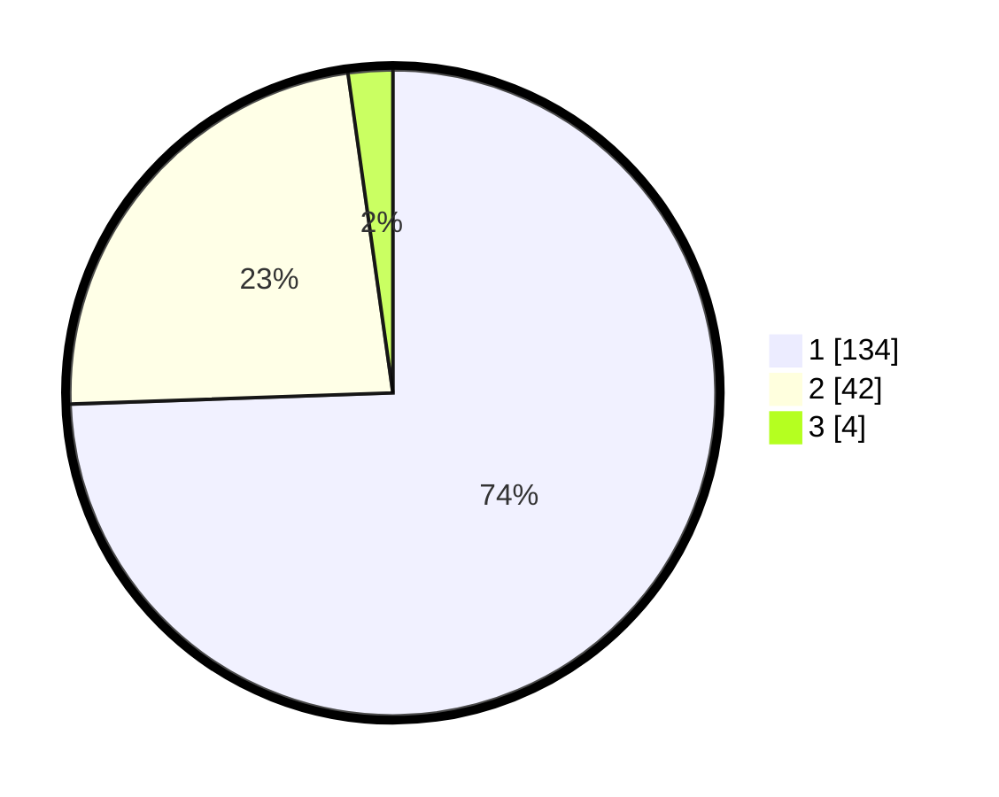

# Hasil

## Grafik

## Tabel

| No. | Nama Paslon    | Suara | Suara (raw) | Persentase |
|:--- |:-------------- | -----:| -----------:| ----------:|
| 1   | ANIES MUHAIMIN | 134   | [134][p-1]  | 74,44      |
| 2   | PRABOWO GIBRAN | 42    | [42][p-2]   | 23,33      |
| 3   | GANJAR MAHFUD  | 4     | [4][p-3]    | 2,22       |

[p-1]: https://github.com/gigit-pemilu/pemilu-2024/blob/main/pilpres/hitung-suara/sub/14-riau/sub/71-kota-pekanbaru/sub/13-tuahmadani/sub/1004-tuahmadani/sub/020-tps/sub/paslon-1.txt
[p-2]: https://github.com/gigit-pemilu/pemilu-2024/blob/main/pilpres/hitung-suara/sub/14-riau/sub/71-kota-pekanbaru/sub/13-tuahmadani/sub/1004-tuahmadani/sub/020-tps/sub/paslon-2.txt
[p-3]: https://github.com/gigit-pemilu/pemilu-2024/blob/main/pilpres/hitung-suara/sub/14-riau/sub/71-kota-pekanbaru/sub/13-tuahmadani/sub/1004-tuahmadani/sub/020-tps/sub/paslon-3.txt

## Foto C Plano

https://sirekap-obj-formc.kpu.go.id/8a4b/pemilu/ppwp/14/71/13/10/04/1471131004020-20240215-001555--6b217726-33b0-43fd-850d-cc276bb29912.jpg

https://sirekap-obj-formc.kpu.go.id/8a4b/pemilu/ppwp/14/71/13/10/04/1471131004020-20240215-001354--2fd71485-bd7f-40a0-8331-1627a0103eb7.jpg

https://sirekap-obj-formc.kpu.go.id/8a4b/pemilu/ppwp/14/71/13/10/04/1471131004020-20240215-001218--ebe43e5f-a3b1-471e-8ea6-56f02308efdf.jpg

## Metadata

| Key        | Value               |
| ---------- | ------------------- |
| Time Stamp | 2024-02-15 15:00:29 |

