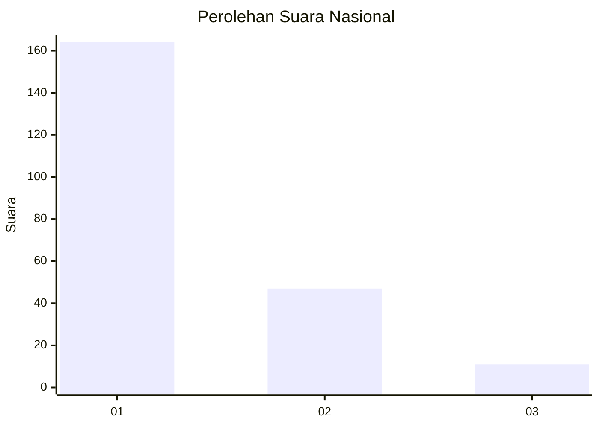
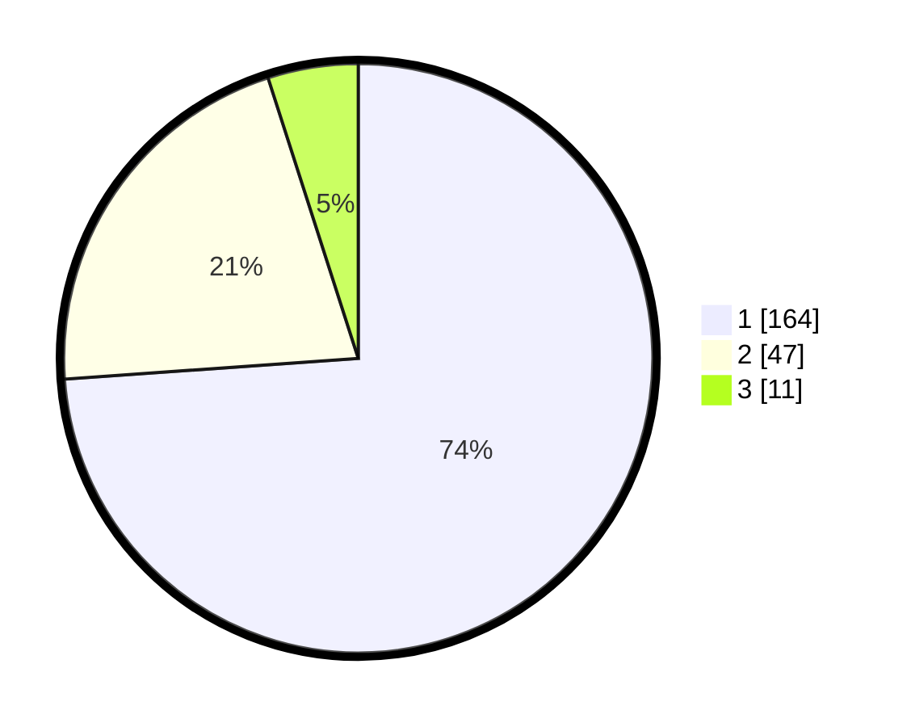

# Hasil

## Grafik

## Tabel

| No. | Nama Paslon    | Suara | Suara (raw) | Persentase |
|:--- |:-------------- | -----:| -----------:| ----------:|
| 1   | ANIES MUHAIMIN | 164   | [164][p-1]  | 73,87      |
| 2   | PRABOWO GIBRAN | 47    | [47][p-2]   | 21,17      |
| 3   | GANJAR MAHFUD  | 11    | [11][p-3]   | 4,95       |

[p-1]: https://github.com/gigit-pemilu/pemilu-2024/blob/main/pilpres/hitung-suara/sub/14-riau/sub/72-kota-dumai/sub/02-dumai-timur/sub/1002-teluk-binjai/sub/001-tps/sub/paslon-1.txt
[p-2]: https://github.com/gigit-pemilu/pemilu-2024/blob/main/pilpres/hitung-suara/sub/14-riau/sub/72-kota-dumai/sub/02-dumai-timur/sub/1002-teluk-binjai/sub/001-tps/sub/paslon-2.txt
[p-3]: https://github.com/gigit-pemilu/pemilu-2024/blob/main/pilpres/hitung-suara/sub/14-riau/sub/72-kota-dumai/sub/02-dumai-timur/sub/1002-teluk-binjai/sub/001-tps/sub/paslon-3.txt

## Foto C Plano

https://sirekap-obj-formc.kpu.go.id/87cd/pemilu/ppwp/14/72/02/10/02/1472021002001-20240215-030236--38728046-f3c2-484c-b35e-112a7a4053b4.jpg

https://sirekap-obj-formc.kpu.go.id/87cd/pemilu/ppwp/14/72/02/10/02/1472021002001-20240215-030309--8f08b03b-0b22-4857-b283-3bf9294df7f4.jpg

https://sirekap-obj-formc.kpu.go.id/87cd/pemilu/ppwp/14/72/02/10/02/1472021002001-20240215-030412--3955c7b1-f9e3-4441-9071-620856f58d95.jpg

## Metadata

| Key        | Value               |
| ---------- | ------------------- |
| Time Stamp | 2024-02-25 14:00:00 |

