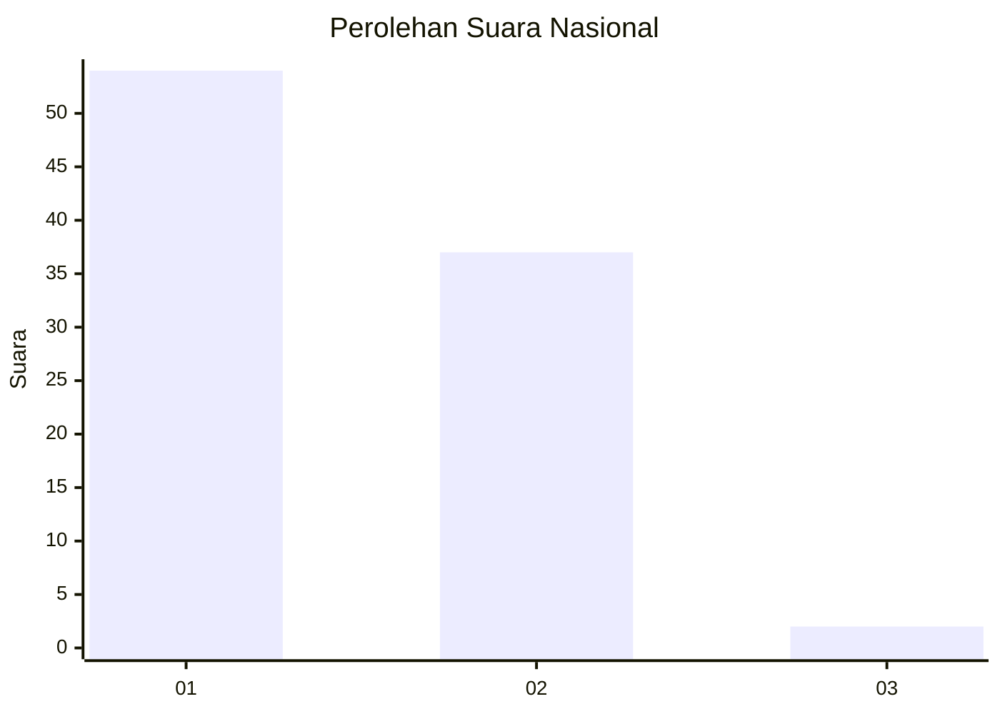
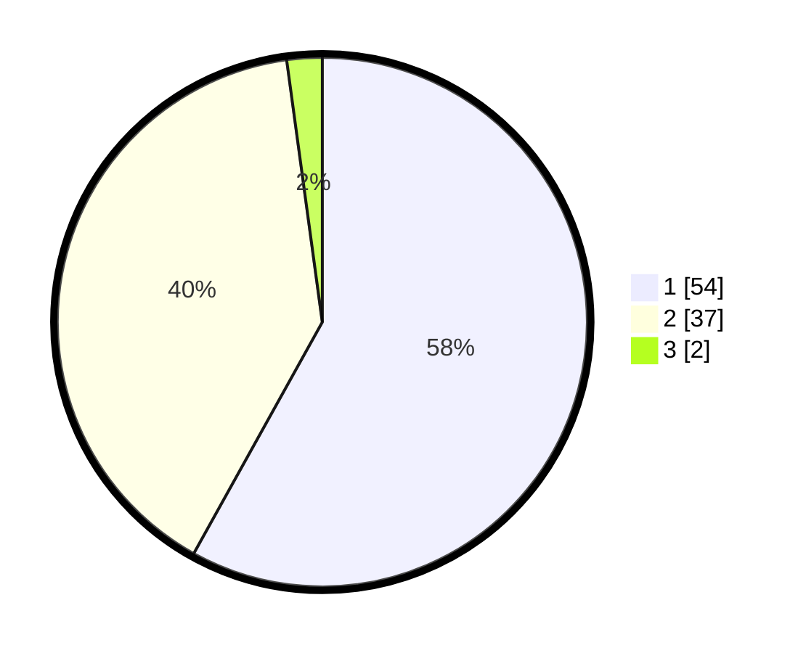

# Hasil

## Grafik

## Tabel

| No. | Nama Paslon    | Suara | Suara (raw) | Persentase |
|:--- |:-------------- | -----:| -----------:| ----------:|
| 1   | ANIES MUHAIMIN | 54    | [54][p-1]   | 58,06      |
| 2   | PRABOWO GIBRAN | 37    | [37][p-2]   | 39,78      |
| 3   | GANJAR MAHFUD  | 2     | [2][p-3]    | 2,15       |

[p-1]: https://github.com/gigit-pemilu/pemilu-2024/blob/main/pilpres/hitung-suara/sub/14-riau/sub/72-kota-dumai/sub/02-dumai-timur/sub/1002-teluk-binjai/sub/021-tps/sub/paslon-1.txt
[p-2]: https://github.com/gigit-pemilu/pemilu-2024/blob/main/pilpres/hitung-suara/sub/14-riau/sub/72-kota-dumai/sub/02-dumai-timur/sub/1002-teluk-binjai/sub/021-tps/sub/paslon-2.txt
[p-3]: https://github.com/gigit-pemilu/pemilu-2024/blob/main/pilpres/hitung-suara/sub/14-riau/sub/72-kota-dumai/sub/02-dumai-timur/sub/1002-teluk-binjai/sub/021-tps/sub/paslon-3.txt

## Foto C Plano

https://sirekap-obj-formc.kpu.go.id/d58a/pemilu/ppwp/14/72/02/10/02/1472021002021-20240214-200435--9aba0307-7e03-4ff3-89a0-3f5d2faffc74.jpg

https://sirekap-obj-formc.kpu.go.id/d58a/pemilu/ppwp/14/72/02/10/02/1472021002021-20240214-200757--46a56009-5441-487b-8128-cdb1a966cb9f.jpg

https://sirekap-obj-formc.kpu.go.id/d58a/pemilu/ppwp/14/72/02/10/02/1472021002021-20240214-200635--4065fc58-4858-49ec-8e7f-3810626e227a.jpg

## Metadata

| Key        | Value               |
| ---------- | ------------------- |
| Time Stamp | 2024-02-26 00:00:00 |

