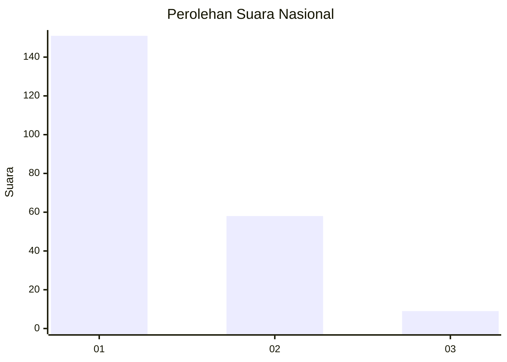
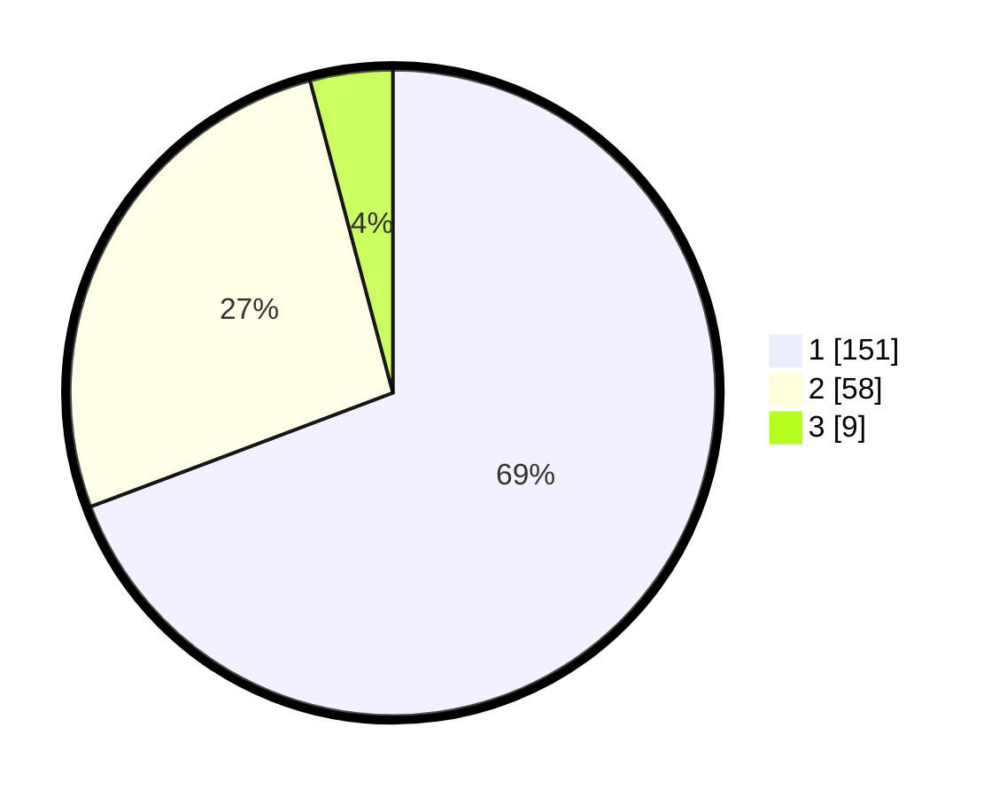

# Hasil

## Grafik

## Tabel

| No. | Nama Paslon    | Suara | Suara (raw) | Persentase |
|:--- |:-------------- | -----:| -----------:| ----------:|
| 1   | ANIES MUHAIMIN | 151   | [151][p-1]  | 69,27      |
| 2   | PRABOWO GIBRAN | 58    | [58][p-2]   | 26,61      |
| 3   | GANJAR MAHFUD  | 9     | [9][p-3]    | 4,13       |

[p-1]: https://github.com/gigit-pemilu/pemilu-2024/blob/main/pilpres/hitung-suara/sub/14-riau/sub/72-kota-dumai/sub/02-dumai-timur/sub/1002-teluk-binjai/sub/036-tps/sub/paslon-1.txt
[p-2]: https://github.com/gigit-pemilu/pemilu-2024/blob/main/pilpres/hitung-suara/sub/14-riau/sub/72-kota-dumai/sub/02-dumai-timur/sub/1002-teluk-binjai/sub/036-tps/sub/paslon-2.txt
[p-3]: https://github.com/gigit-pemilu/pemilu-2024/blob/main/pilpres/hitung-suara/sub/14-riau/sub/72-kota-dumai/sub/02-dumai-timur/sub/1002-teluk-binjai/sub/036-tps/sub/paslon-3.txt

## Foto C Plano

https://sirekap-obj-formc.kpu.go.id/d165/pemilu/ppwp/14/72/02/10/02/1472021002036-20240215-000842--72b2d64c-f397-45f6-a47e-99437e394185.jpg

https://sirekap-obj-formc.kpu.go.id/d165/pemilu/ppwp/14/72/02/10/02/1472021002036-20240215-001234--c42ef6dd-5e49-477c-b596-3c5836bbb514.jpg

https://sirekap-obj-formc.kpu.go.id/d165/pemilu/ppwp/14/72/02/10/02/1472021002036-20240215-001519--bb8a28f2-8427-4249-a9d3-9385b017a660.jpg

## Metadata

| Key        | Value               |
| ---------- | ------------------- |
| Time Stamp | 2024-02-15 16:30:25 |

