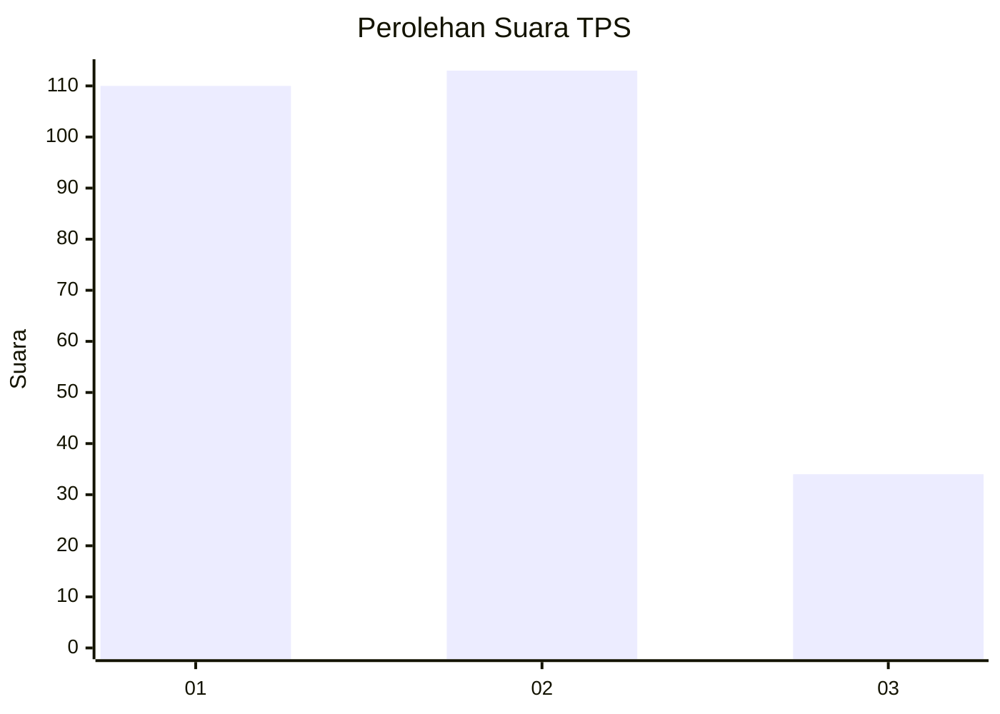
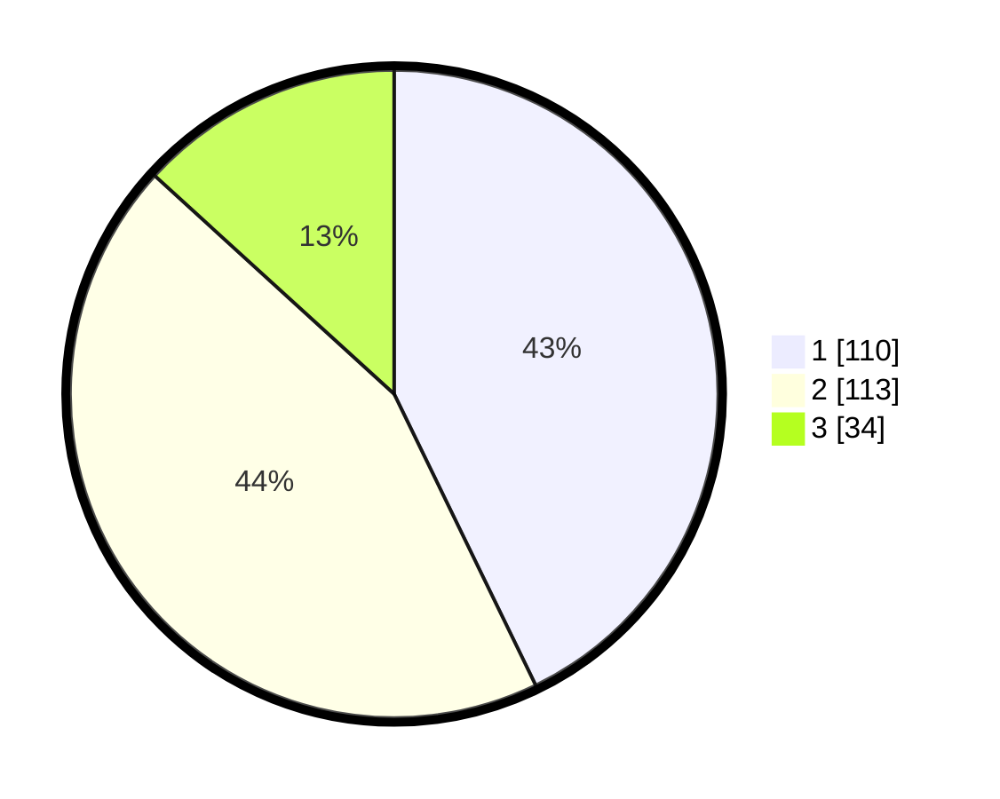

# Hasil

## Grafik

## Tabel

| No. | Nama Paslon    | Suara | Suara (raw) | Persentase |
|:--- |:-------------- | -----:| -----------:| ----------:|
| 1   | ANIES MUHAIMIN | 110   | [110][p-1]  | 42,80      |
| 2   | PRABOWO GIBRAN | 113   | [113][p-2]  | 43,97      |
| 3   | GANJAR MAHFUD  | 34    | [34][p-3]   | 13,23      |

[p-1]: https://github.com/gigit-pemilu/pemilu-2024-14-riau/blob/main/pilpres/hitung-suara/sub/14-riau/sub/72-kota-dumai/sub/02-dumai-timur/sub/1004-jaya-mukti/sub/018-tps/sub/paslon-1.txt
[p-2]: https://github.com/gigit-pemilu/pemilu-2024-14-riau/blob/main/pilpres/hitung-suara/sub/14-riau/sub/72-kota-dumai/sub/02-dumai-timur/sub/1004-jaya-mukti/sub/018-tps/sub/paslon-2.txt
[p-3]: https://github.com/gigit-pemilu/pemilu-2024-14-riau/blob/main/pilpres/hitung-suara/sub/14-riau/sub/72-kota-dumai/sub/02-dumai-timur/sub/1004-jaya-mukti/sub/018-tps/sub/paslon-3.txt

## Foto C Plano

https://sirekap-obj-formc.kpu.go.id/3fce/pemilu/ppwp/14/72/02/10/04/1472021004018-20240215-004343--c24f53f6-1bfd-483d-90da-c261a2d365e7.jpg

https://sirekap-obj-formc.kpu.go.id/3fce/pemilu/ppwp/14/72/02/10/04/1472021004018-20240215-004503--2077e7f5-19f2-456b-8caa-afe33d5e0c2b.jpg

https://sirekap-obj-formc.kpu.go.id/3fce/pemilu/ppwp/14/72/02/10/04/1472021004018-20240215-004648--8e854787-057f-4070-bc82-d505f9ef6db1.jpg

## Metadata

| Key        | Value               |
| ---------- | ------------------- |
| Time Stamp | 2024-02-24 22:31:28 |

