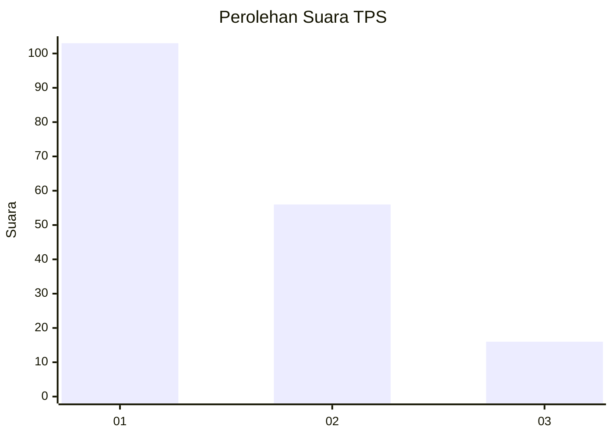
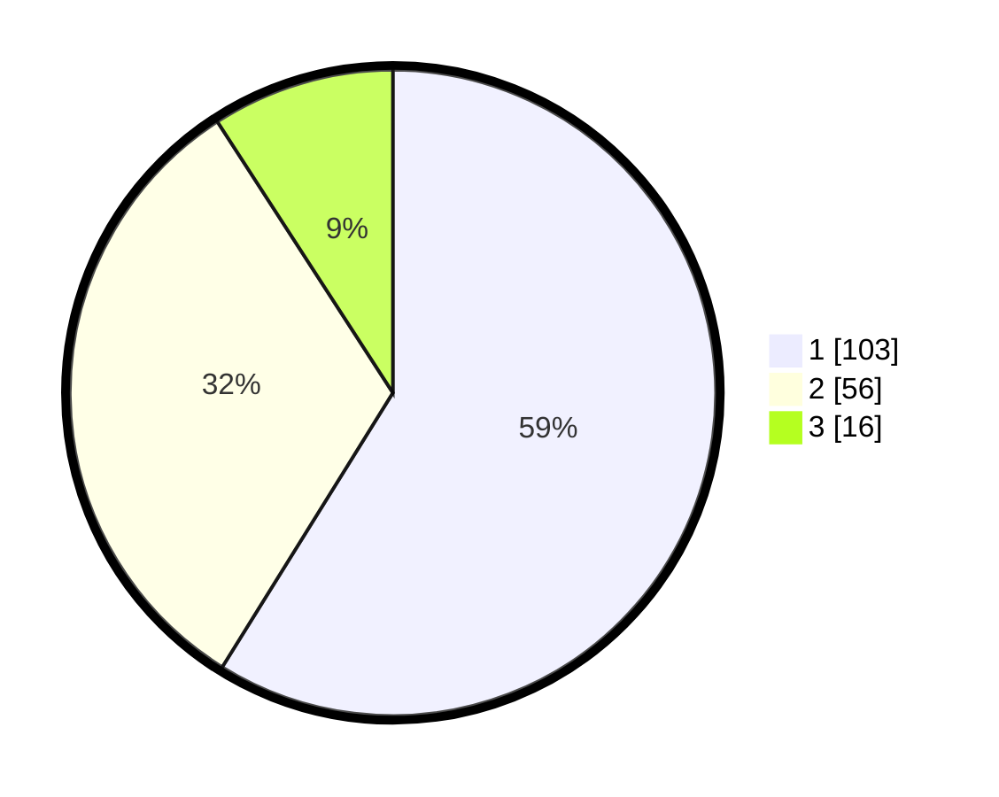

# Hasil

## Grafik

## Tabel

| No. | Nama Paslon    | Suara | Suara (raw) | Persentase |
|:--- |:-------------- | -----:| -----------:| ----------:|
| 1   | ANIES MUHAIMIN | 103   | [103][p-1]  | 58,86      |
| 2   | PRABOWO GIBRAN | 56    | [56][p-2]   | 32,00      |
| 3   | GANJAR MAHFUD  | 16    | [16][p-3]   | 9,14       |

[p-1]: https://github.com/gigit-pemilu/pemilu-2024-14-riau/blob/main/pilpres/hitung-suara/sub/14-riau/sub/72-kota-dumai/sub/02-dumai-timur/sub/1004-jaya-mukti/sub/045-tps/sub/paslon-1.txt
[p-2]: https://github.com/gigit-pemilu/pemilu-2024-14-riau/blob/main/pilpres/hitung-suara/sub/14-riau/sub/72-kota-dumai/sub/02-dumai-timur/sub/1004-jaya-mukti/sub/045-tps/sub/paslon-2.txt
[p-3]: https://github.com/gigit-pemilu/pemilu-2024-14-riau/blob/main/pilpres/hitung-suara/sub/14-riau/sub/72-kota-dumai/sub/02-dumai-timur/sub/1004-jaya-mukti/sub/045-tps/sub/paslon-3.txt

## Foto C Plano

https://sirekap-obj-formc.kpu.go.id/eae4/pemilu/ppwp/14/72/02/10/04/1472021004045-20240215-034141--280d4956-2416-419a-a36b-d1ad80fc745c.jpg

https://sirekap-obj-formc.kpu.go.id/eae4/pemilu/ppwp/14/72/02/10/04/1472021004045-20240215-034527--deac9a8a-0d9b-4247-80f3-9926583fb282.jpg

https://sirekap-obj-formc.kpu.go.id/eae4/pemilu/ppwp/14/72/02/10/04/1472021004045-20240215-033611--5f18fa87-9bc3-4b19-8ad7-1207ba5d4ebd.jpg

## Metadata

| Key        | Value               |
| ---------- | ------------------- |
| Time Stamp | 2024-02-25 11:00:00 |

