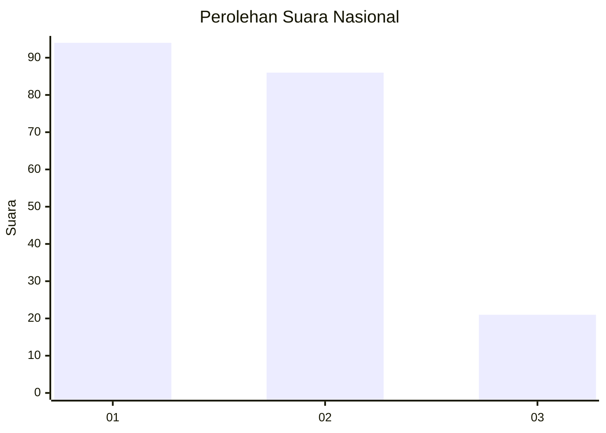
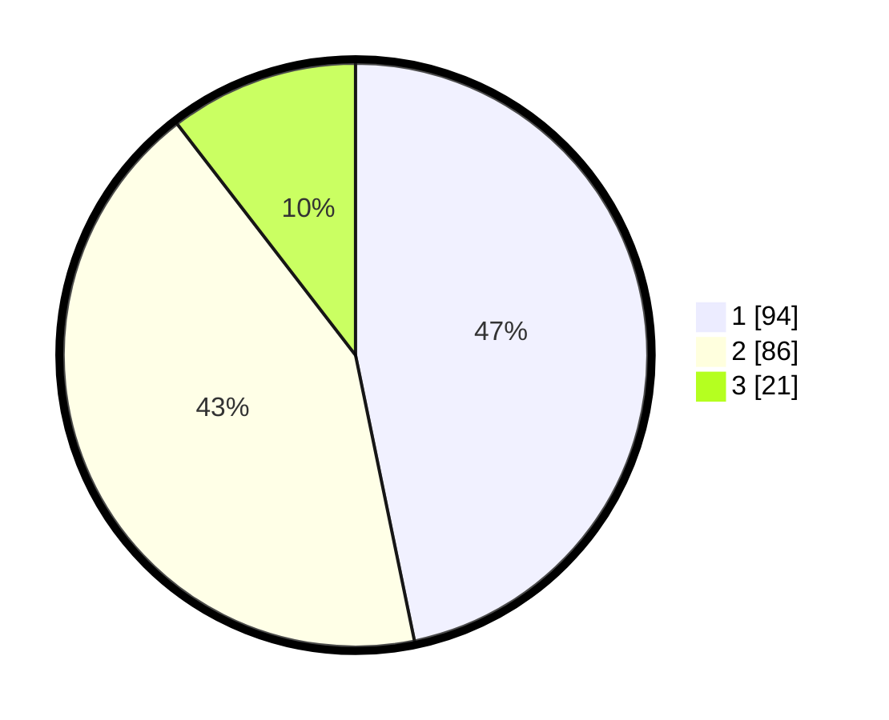

# Hasil

## Grafik

## Tabel

| No. | Nama Paslon    | Suara | Suara (raw) | Persentase |
|:--- |:-------------- | -----:| -----------:| ----------:|
| 1   | ANIES MUHAIMIN | 94    | [94][p-1]   | 46,77      |
| 2   | PRABOWO GIBRAN | 86    | [86][p-2]   | 42,79      |
| 3   | GANJAR MAHFUD  | 21    | [21][p-3]   | 10,45      |

[p-1]: https://github.com/gigit-pemilu/pemilu-2024/blob/main/pilpres/hitung-suara/sub/14-riau/sub/72-kota-dumai/sub/02-dumai-timur/sub/1009-bukit-batrem/sub/010-tps/sub/paslon-1.txt
[p-2]: https://github.com/gigit-pemilu/pemilu-2024/blob/main/pilpres/hitung-suara/sub/14-riau/sub/72-kota-dumai/sub/02-dumai-timur/sub/1009-bukit-batrem/sub/010-tps/sub/paslon-2.txt
[p-3]: https://github.com/gigit-pemilu/pemilu-2024/blob/main/pilpres/hitung-suara/sub/14-riau/sub/72-kota-dumai/sub/02-dumai-timur/sub/1009-bukit-batrem/sub/010-tps/sub/paslon-3.txt

## Foto C Plano

https://sirekap-obj-formc.kpu.go.id/7220/pemilu/ppwp/14/72/02/10/09/1472021009010-20240215-044503--61150f3c-47ae-46ce-847d-0de04766efde.jpg

https://sirekap-obj-formc.kpu.go.id/7220/pemilu/ppwp/14/72/02/10/09/1472021009010-20240215-044611--0c5d28d7-dd4a-4d38-978f-c5dfaaf28f21.jpg

https://sirekap-obj-formc.kpu.go.id/7220/pemilu/ppwp/14/72/02/10/09/1472021009010-20240215-044725--98696360-a10f-4058-a1f6-eeed5b2797d8.jpg

## Metadata

| Key        | Value               |
| ---------- | ------------------- |
| Time Stamp | 2024-02-25 18:00:00 |

