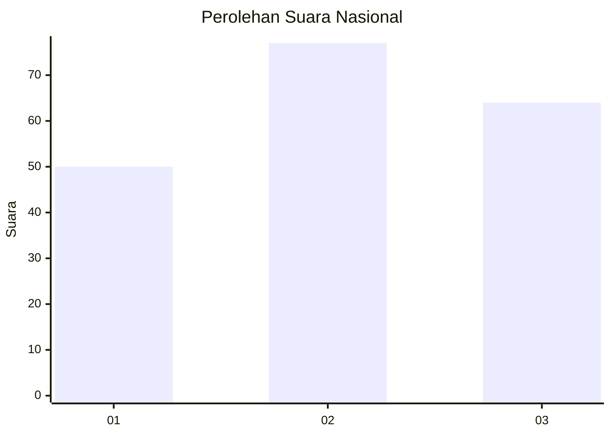
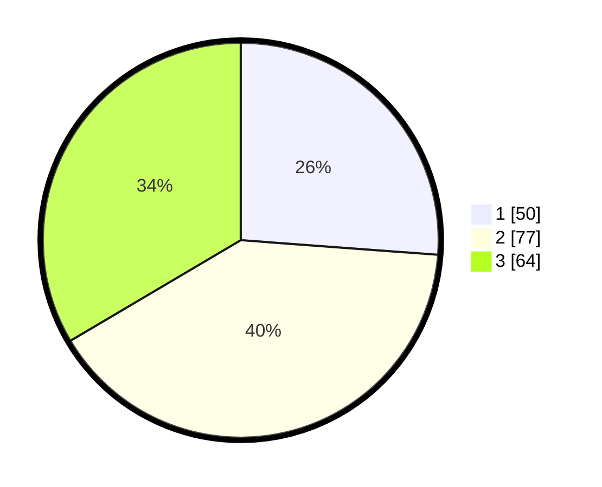

# Hasil

## Grafik

## Tabel

| No. | Nama Paslon    | Suara | Suara (raw) | Persentase |
|:--- |:-------------- | -----:| -----------:| ----------:|
| 1   | ANIES MUHAIMIN | 50    | [50][p-1]   | 26,18      |
| 2   | PRABOWO GIBRAN | 77    | [77][p-2]   | 40,31      |
| 3   | GANJAR MAHFUD  | 64    | [64][p-3]   | 33,51      |

[p-1]: https://github.com/gigit-pemilu/pemilu-2024/blob/main/pilpres/hitung-suara/sub/14-riau/sub/72-kota-dumai/sub/03-bukit-kapur/sub/1004-bagan-besar/sub/001-tps/sub/paslon-1.txt
[p-2]: https://github.com/gigit-pemilu/pemilu-2024/blob/main/pilpres/hitung-suara/sub/14-riau/sub/72-kota-dumai/sub/03-bukit-kapur/sub/1004-bagan-besar/sub/001-tps/sub/paslon-2.txt
[p-3]: https://github.com/gigit-pemilu/pemilu-2024/blob/main/pilpres/hitung-suara/sub/14-riau/sub/72-kota-dumai/sub/03-bukit-kapur/sub/1004-bagan-besar/sub/001-tps/sub/paslon-3.txt

## Foto C Plano

https://sirekap-obj-formc.kpu.go.id/de79/pemilu/ppwp/14/72/03/10/04/1472031004001-20240220-094300--b7c78854-8f53-4e9c-aa30-88e8102249fe.jpg

https://sirekap-obj-formc.kpu.go.id/de79/pemilu/ppwp/14/72/03/10/04/1472031004001-20240220-094824--7cad0131-54d6-41d5-a656-0f4e46449eef.jpg

https://sirekap-obj-formc.kpu.go.id/de79/pemilu/ppwp/14/72/03/10/04/1472031004001-20240220-095205--1d3c5ae1-4ea4-482e-97d9-657531c17673.jpg

## Metadata

| Key        | Value               |
| ---------- | ------------------- |
| Time Stamp | 2024-02-20 10:00:00 |

## DATA PEMILIH TETAP

Jumlah pemilih dalam DPT: **280**.
 * L: **239**.
 * P: **247**.

## DATA PENGGUNA HAK PILIH

Jumlah pengguna hak pilih dalam DPT: **787**.
 * L: **90**.
 * P: **97**.

Jumlah pengguna hak pilih dalam DPTb: **875**.
 * L: **2**.
 * P: **3**.

Jumlah pengguna hak pilih dalam DPK: **70**.
 * L: **4**.
 * P: **6**.

Jumlah pengguna hak pilih: **202**.
 * L: **96**.
 * P: **706**.

## JUMLAH SUARA SAH DAN TIDAK SAH

JUMLAH SELURUH SUARA SAH: **798**.

JUMLAH SUARA TIDAK SAH: **4**.

JUMLAH SELURUH SUARA SAH DAN SUARA TIDAK SAH: **202**.

