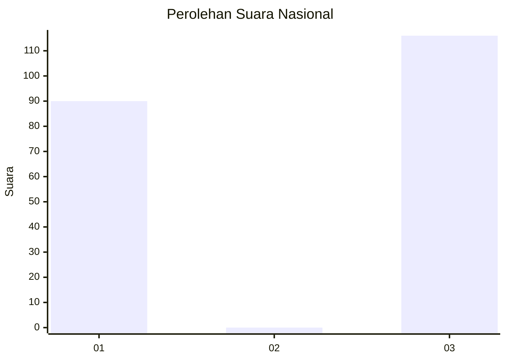
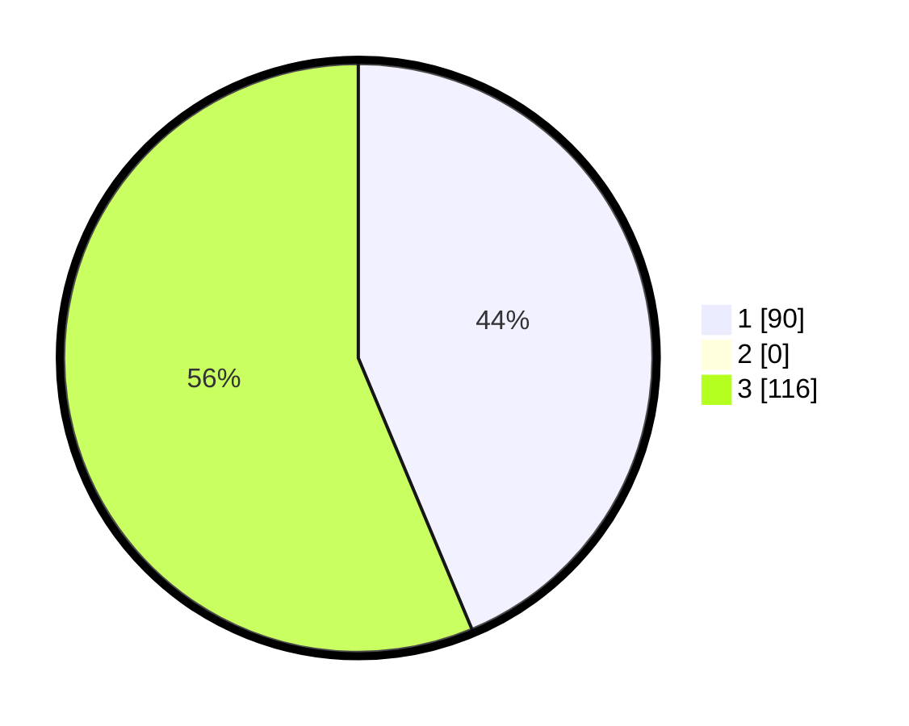

# Hasil

## Grafik

## Tabel

| No. | Nama Paslon    | Suara | Suara (raw) | Persentase |
|:--- |:-------------- | -----:| -----------:| ----------:|
| 1   | ANIES MUHAIMIN | 90    | [90][p-1]   | 43,69      |
| 2   | PRABOWO GIBRAN | 0     | [0][p-2]    | 0,00       |
| 3   | GANJAR MAHFUD  | 116   | [116][p-3]  | 56,31      |

[p-1]: https://github.com/gigit-pemilu/pemilu-2024/blob/main/pilpres/hitung-suara/sub/14-riau/sub/72-kota-dumai/sub/03-bukit-kapur/sub/1004-bagan-besar/sub/002-tps/sub/paslon-1.txt
[p-2]: https://github.com/gigit-pemilu/pemilu-2024/blob/main/pilpres/hitung-suara/sub/14-riau/sub/72-kota-dumai/sub/03-bukit-kapur/sub/1004-bagan-besar/sub/002-tps/sub/paslon-2.txt
[p-3]: https://github.com/gigit-pemilu/pemilu-2024/blob/main/pilpres/hitung-suara/sub/14-riau/sub/72-kota-dumai/sub/03-bukit-kapur/sub/1004-bagan-besar/sub/002-tps/sub/paslon-3.txt

## Foto C Plano

https://sirekap-obj-formc.kpu.go.id/acb3/pemilu/ppwp/14/72/03/10/04/1472031004002-20240220-102011--72ece780-4464-4cdb-91f2-a8b57de18f4f.jpg

https://sirekap-obj-formc.kpu.go.id/acb3/pemilu/ppwp/14/72/03/10/04/1472031004002-20240220-102213--ff3c3cd6-090c-45e9-9509-5af96c2dba94.jpg

https://sirekap-obj-formc.kpu.go.id/acb3/pemilu/ppwp/14/72/03/10/04/1472031004002-20240220-102915--4ec754fd-3a53-49ae-8afa-2e697cad107d.jpg

## Metadata

| Key        | Value               |
| ---------- | ------------------- |
| Time Stamp | 2024-02-20 11:00:00 |

## DATA PEMILIH TETAP

Jumlah pemilih dalam DPT: **1**.
 * L: **0**.
 * P: **0**.

## DATA PENGGUNA HAK PILIH

Jumlah pengguna hak pilih dalam DPT: **4**.
 * L: **0**.
 * P: **7**.

Jumlah pengguna hak pilih dalam DPTb: **742**.
 * L: **5**.
 * P: **777**.

Jumlah pengguna hak pilih dalam DPK: **550**.
 * L: **3**.
 * P: **7**.

Jumlah pengguna hak pilih: **251**.
 * L: **105**.
 * P: **177**.

## JUMLAH SUARA SAH DAN TIDAK SAH

JUMLAH SELURUH SUARA SAH: **225**.

JUMLAH SUARA TIDAK SAH: **0**.

JUMLAH SELURUH SUARA SAH DAN SUARA TIDAK SAH: **225**.

