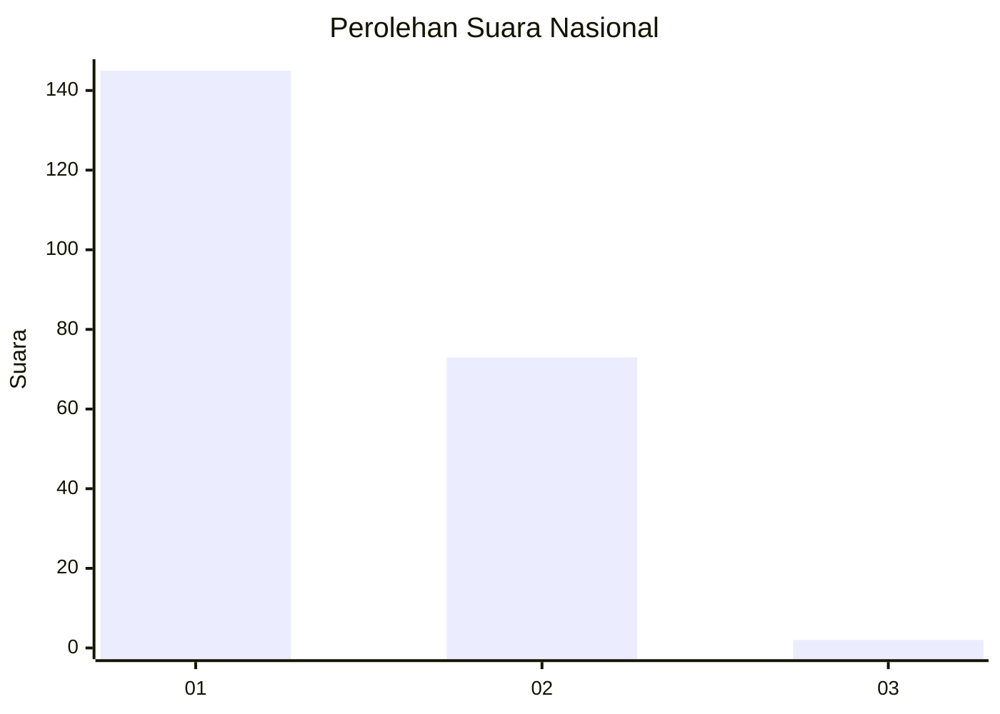
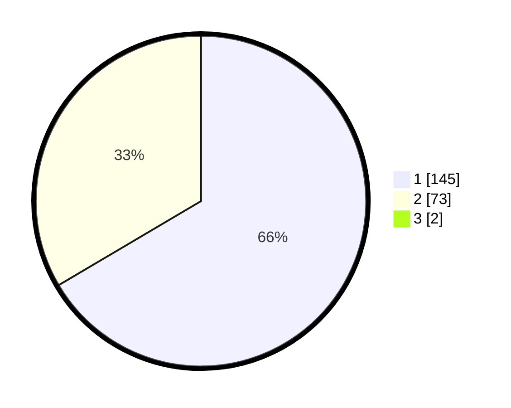

# Hasil

## Grafik

## Tabel

| No. | Nama Paslon    | Suara | Suara (raw) | Persentase |
|:--- |:-------------- | -----:| -----------:| ----------:|
| 1   | ANIES MUHAIMIN | 145   | [145][p-1]  | 65,91      |
| 2   | PRABOWO GIBRAN | 73    | [73][p-2]   | 33,18      |
| 3   | GANJAR MAHFUD  | 2     | [2][p-3]    | 0,91       |

[p-1]: https://github.com/gigit-pemilu/pemilu-2024/blob/main/pilpres/hitung-suara/sub/14-riau/sub/72-kota-dumai/sub/03-bukit-kapur/sub/1006-bagan-besar-timur/sub/002-tps/sub/paslon-1.txt
[p-2]: https://github.com/gigit-pemilu/pemilu-2024/blob/main/pilpres/hitung-suara/sub/14-riau/sub/72-kota-dumai/sub/03-bukit-kapur/sub/1006-bagan-besar-timur/sub/002-tps/sub/paslon-2.txt
[p-3]: https://github.com/gigit-pemilu/pemilu-2024/blob/main/pilpres/hitung-suara/sub/14-riau/sub/72-kota-dumai/sub/03-bukit-kapur/sub/1006-bagan-besar-timur/sub/002-tps/sub/paslon-3.txt

## Foto C Plano

https://sirekap-obj-formc.kpu.go.id/5db6/pemilu/ppwp/14/72/03/10/06/1472031006002-20240220-101447--a2872bbc-1aec-4a3b-8b57-5b9f4871364b.jpg

https://sirekap-obj-formc.kpu.go.id/5db6/pemilu/ppwp/14/72/03/10/06/1472031006002-20240220-101534--506fc863-ac14-4392-9b74-2984234208f5.jpg

https://sirekap-obj-formc.kpu.go.id/5db6/pemilu/ppwp/14/72/03/10/06/1472031006002-20240220-101609--7931295f-6005-47bf-82b7-5bcd0b9515a4.jpg

## Metadata

| Key        | Value               |
| ---------- | ------------------- |
| Time Stamp | 2024-02-25 15:00:00 |

