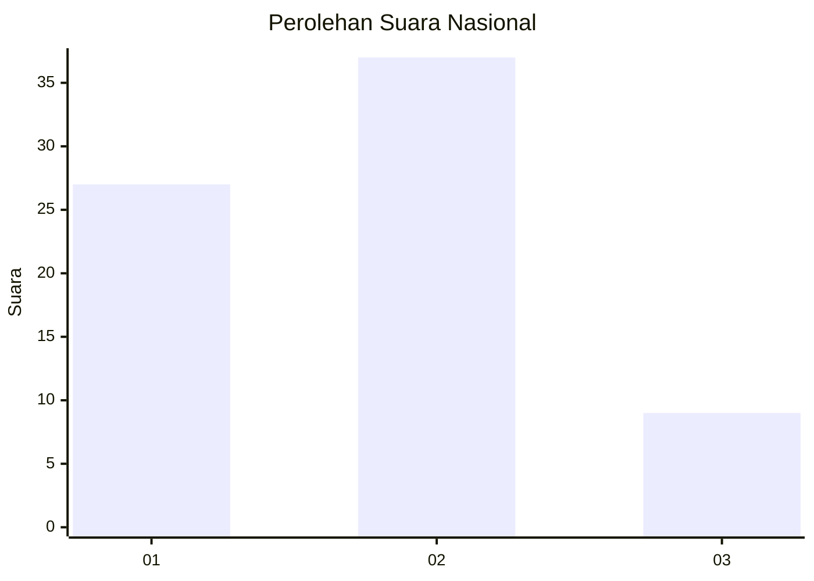
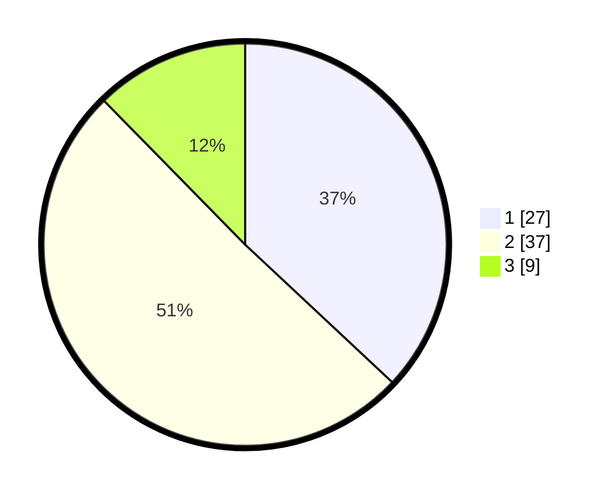

# Hasil

## Grafik

## Tabel

| No. | Nama Paslon    | Suara | Suara (raw) | Persentase |
|:--- |:-------------- | -----:| -----------:| ----------:|
| 1   | ANIES MUHAIMIN | 27    | [27][p-1]   | 36,99      |
| 2   | PRABOWO GIBRAN | 37    | [37][p-2]   | 50,68      |
| 3   | GANJAR MAHFUD  | 9     | [9][p-3]    | 12,33      |

[p-1]: https://github.com/gigit-pemilu/pemilu-2024/blob/main/pilpres/hitung-suara/sub/14-riau/sub/72-kota-dumai/sub/04-sungai-sembilan/sub/1001-lubuk-gaung/sub/901-tps/sub/paslon-1.txt
[p-2]: https://github.com/gigit-pemilu/pemilu-2024/blob/main/pilpres/hitung-suara/sub/14-riau/sub/72-kota-dumai/sub/04-sungai-sembilan/sub/1001-lubuk-gaung/sub/901-tps/sub/paslon-2.txt
[p-3]: https://github.com/gigit-pemilu/pemilu-2024/blob/main/pilpres/hitung-suara/sub/14-riau/sub/72-kota-dumai/sub/04-sungai-sembilan/sub/1001-lubuk-gaung/sub/901-tps/sub/paslon-3.txt

## Foto C Plano

https://sirekap-obj-formc.kpu.go.id/ed79/pemilu/ppwp/14/72/04/10/01/1472041001901-20240214-211003--da7e35f5-7d36-4da8-bd07-f1831e24ea3b.jpg

https://sirekap-obj-formc.kpu.go.id/ed79/pemilu/ppwp/14/72/04/10/01/1472041001901-20240214-211108--1c764acf-498e-4da0-8d36-7c01e885ebd1.jpg

https://sirekap-obj-formc.kpu.go.id/ed79/pemilu/ppwp/14/72/04/10/01/1472041001901-20240214-211144--a9cedf98-5cca-44d1-9c2e-98f5746a2482.jpg

## Metadata

| Key        | Value               |
| ---------- | ------------------- |
| Time Stamp | 2024-02-15 21:30:27 |

