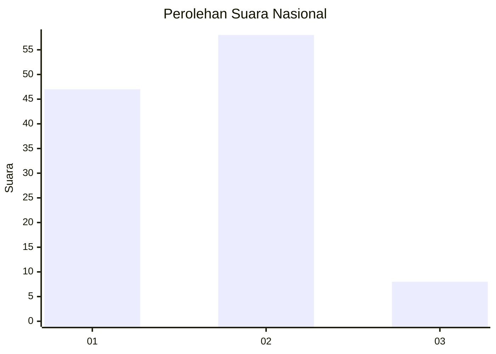
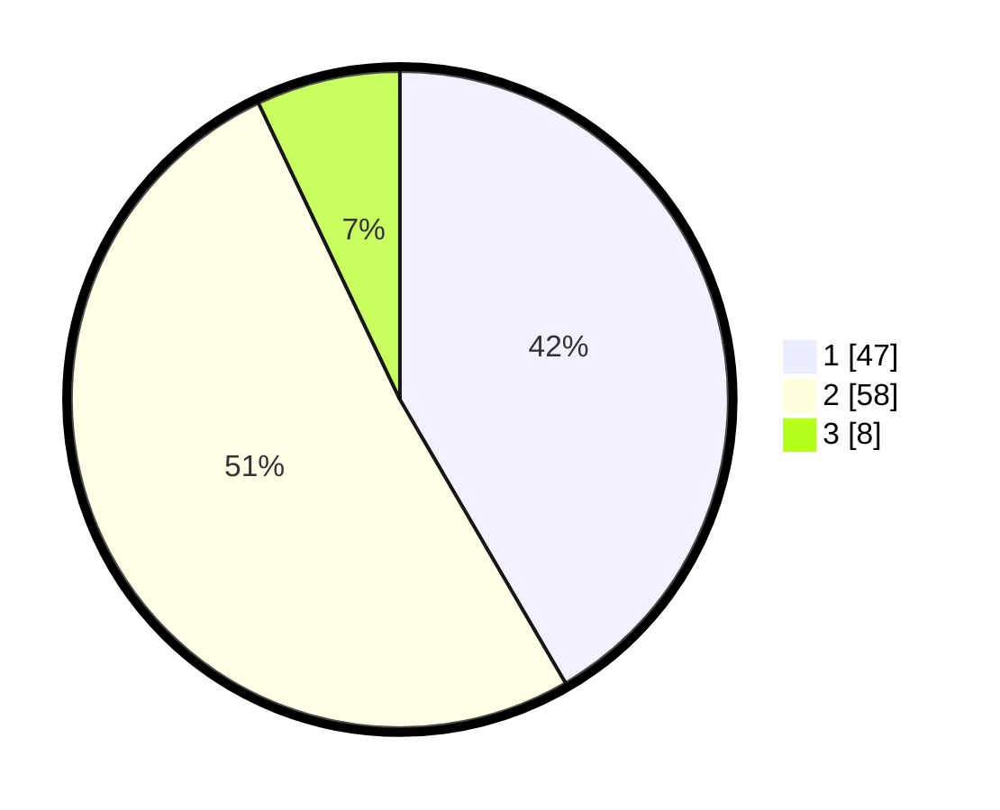

# Hasil

## Grafik

## Tabel

| No. | Nama Paslon    | Suara | Suara (raw) | Persentase |
|:--- |:-------------- | -----:| -----------:| ----------:|
| 1   | ANIES MUHAIMIN | 47    | [47][p-1]   | 41,59      |
| 2   | PRABOWO GIBRAN | 58    | [58][p-2]   | 51,33      |
| 3   | GANJAR MAHFUD  | 8     | [8][p-3]    | 7,08       |

[p-1]: https://github.com/gigit-pemilu/pemilu-2024/blob/main/pilpres/hitung-suara/sub/14-riau/sub/72-kota-dumai/sub/05-medang-kampai/sub/1004-pelintung/sub/019-tps/sub/paslon-1.txt
[p-2]: https://github.com/gigit-pemilu/pemilu-2024/blob/main/pilpres/hitung-suara/sub/14-riau/sub/72-kota-dumai/sub/05-medang-kampai/sub/1004-pelintung/sub/019-tps/sub/paslon-2.txt
[p-3]: https://github.com/gigit-pemilu/pemilu-2024/blob/main/pilpres/hitung-suara/sub/14-riau/sub/72-kota-dumai/sub/05-medang-kampai/sub/1004-pelintung/sub/019-tps/sub/paslon-3.txt

## Foto C Plano

https://sirekap-obj-formc.kpu.go.id/6e27/pemilu/ppwp/14/72/05/10/04/1472051004019-20240215-051412--16f56c80-f775-4425-966b-70c5161dc91d.jpg

https://sirekap-obj-formc.kpu.go.id/6e27/pemilu/ppwp/14/72/05/10/04/1472051004019-20240215-051515--75f5647c-9dd4-4745-9ecf-d3c84ef39740.jpg

https://sirekap-obj-formc.kpu.go.id/6e27/pemilu/ppwp/14/72/05/10/04/1472051004019-20240215-051837--616ca8e0-b5ae-4614-8151-1976072d8043.jpg

## Metadata

| Key        | Value               |
| ---------- | ------------------- |
| Time Stamp | 2024-02-19 06:16:00 |

