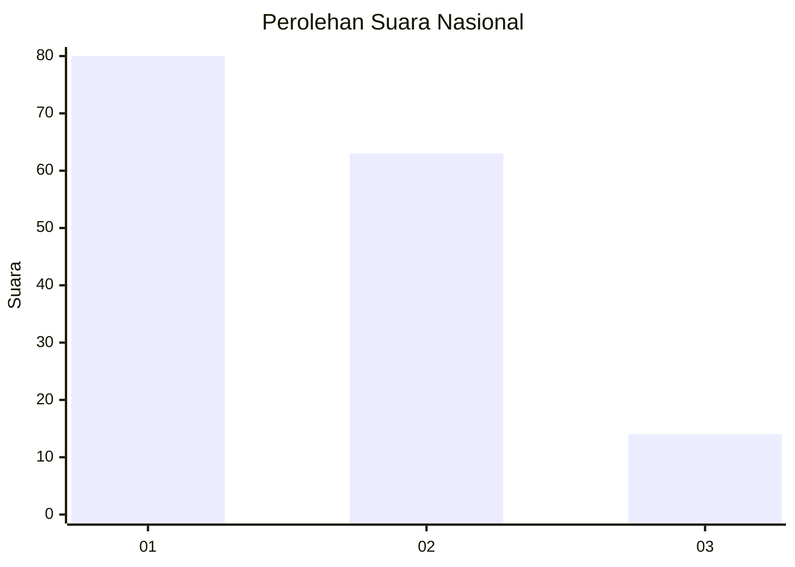
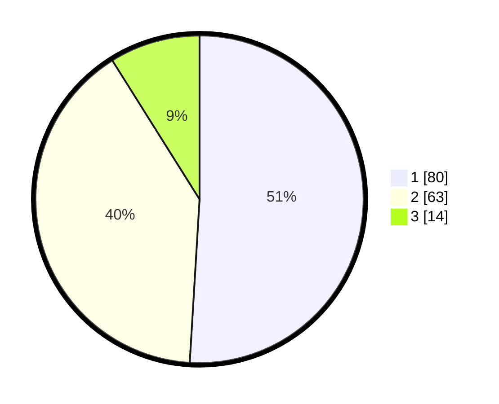

# Hasil

## Grafik

## Tabel

| No. | Nama Paslon    | Suara | Suara (raw) | Persentase |
|:--- |:-------------- | -----:| -----------:| ----------:|
| 1   | ANIES MUHAIMIN | 80    | [80][p-1]   | 50,96      |
| 2   | PRABOWO GIBRAN | 63    | [63][p-2]   | 40,13      |
| 3   | GANJAR MAHFUD  | 14    | [14][p-3]   | 8,92       |

[p-1]: https://github.com/gigit-pemilu/pemilu-2024/blob/main/pilpres/hitung-suara/sub/14-riau/sub/72-kota-dumai/sub/06-dumai-kota/sub/1001-laksamana/sub/001-tps/sub/paslon-1.txt
[p-2]: https://github.com/gigit-pemilu/pemilu-2024/blob/main/pilpres/hitung-suara/sub/14-riau/sub/72-kota-dumai/sub/06-dumai-kota/sub/1001-laksamana/sub/001-tps/sub/paslon-2.txt
[p-3]: https://github.com/gigit-pemilu/pemilu-2024/blob/main/pilpres/hitung-suara/sub/14-riau/sub/72-kota-dumai/sub/06-dumai-kota/sub/1001-laksamana/sub/001-tps/sub/paslon-3.txt

## Foto C Plano

https://sirekap-obj-formc.kpu.go.id/8c4d/pemilu/ppwp/14/72/06/10/01/1472061001001-20240215-042807--1a946b57-2295-4085-a758-73fadb32e6f0.jpg

https://sirekap-obj-formc.kpu.go.id/8c4d/pemilu/ppwp/14/72/06/10/01/1472061001001-20240215-042906--3f6c3f88-f8da-4fd3-b7b7-2436a7d6ea52.jpg

https://sirekap-obj-formc.kpu.go.id/8c4d/pemilu/ppwp/14/72/06/10/01/1472061001001-20240215-043052--39e9707c-c67f-490a-850a-83dcccab6bf7.jpg

## Metadata

| Key        | Value               |
| ---------- | ------------------- |
| Time Stamp | 2024-02-16 01:30:27 |

