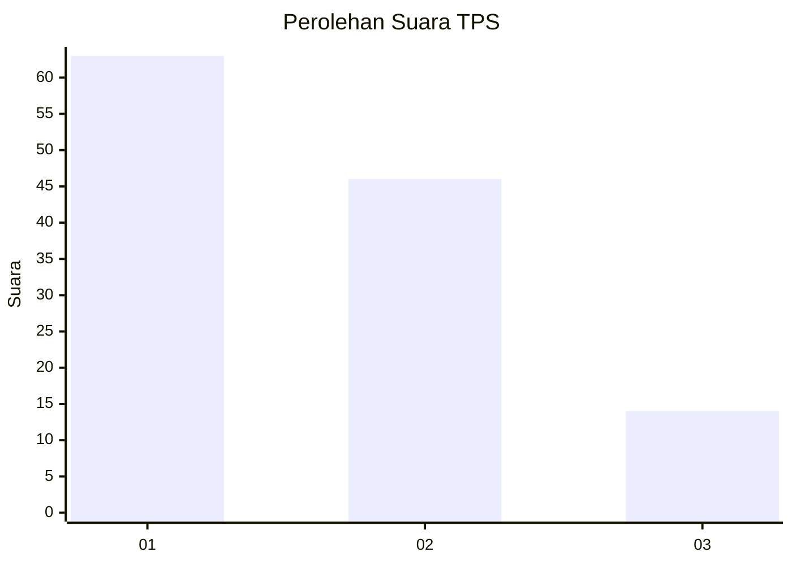
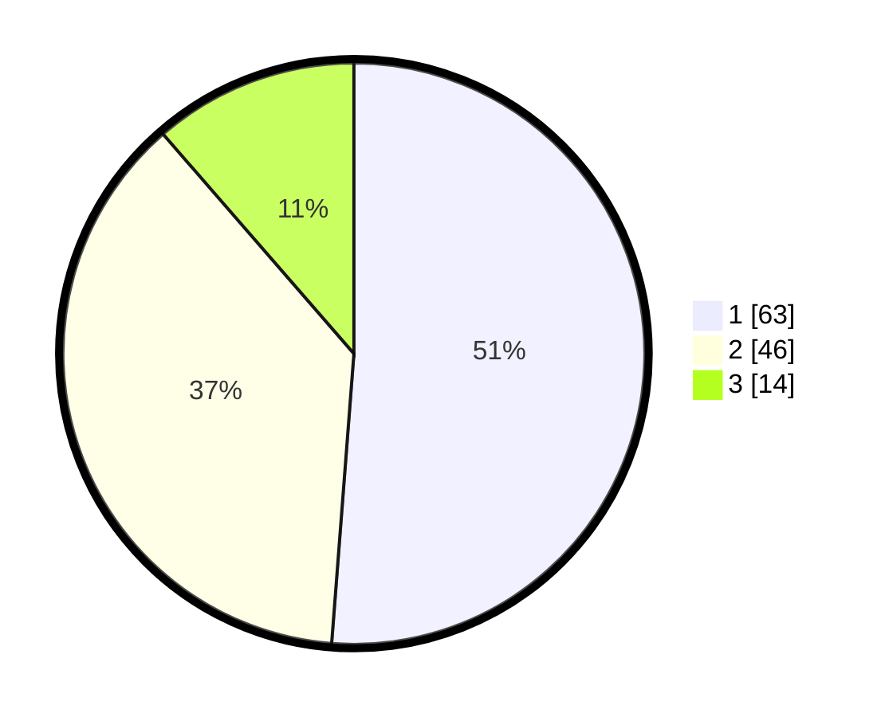

# Hasil

## Grafik

## Tabel

| No. | Nama Paslon    | Suara | Suara (raw) | Persentase |
|:--- |:-------------- | -----:| -----------:| ----------:|
| 1   | ANIES MUHAIMIN | 63    | [63][p-1]   | 51,22      |
| 2   | PRABOWO GIBRAN | 46    | [46][p-2]   | 37,40      |
| 3   | GANJAR MAHFUD  | 14    | [14][p-3]   | 11,38      |

[p-1]: https://github.com/gigit-pemilu/pemilu-2024-14-riau/blob/main/pilpres/hitung-suara/sub/14-riau/sub/72-kota-dumai/sub/06-dumai-kota/sub/1001-laksamana/sub/002-tps/sub/paslon-1.txt
[p-2]: https://github.com/gigit-pemilu/pemilu-2024-14-riau/blob/main/pilpres/hitung-suara/sub/14-riau/sub/72-kota-dumai/sub/06-dumai-kota/sub/1001-laksamana/sub/002-tps/sub/paslon-2.txt
[p-3]: https://github.com/gigit-pemilu/pemilu-2024-14-riau/blob/main/pilpres/hitung-suara/sub/14-riau/sub/72-kota-dumai/sub/06-dumai-kota/sub/1001-laksamana/sub/002-tps/sub/paslon-3.txt

## Foto C Plano

https://sirekap-obj-formc.kpu.go.id/375a/pemilu/ppwp/14/72/06/10/01/1472061001002-20240217-140334--bf8a628b-0555-4e69-8605-2cfbb9701231.jpg

https://sirekap-obj-formc.kpu.go.id/375a/pemilu/ppwp/14/72/06/10/01/1472061001002-20240214-191845--f8ceed41-a5bc-4251-bca4-739a3f3e3a10.jpg

https://sirekap-obj-formc.kpu.go.id/375a/pemilu/ppwp/14/72/06/10/01/1472061001002-20240214-191931--ba54b359-e242-4bfc-b4d5-8312bd65777d.jpg

## Metadata

| Key        | Value               |
| ---------- | ------------------- |
| Time Stamp | 2024-02-17 14:45:18 |

