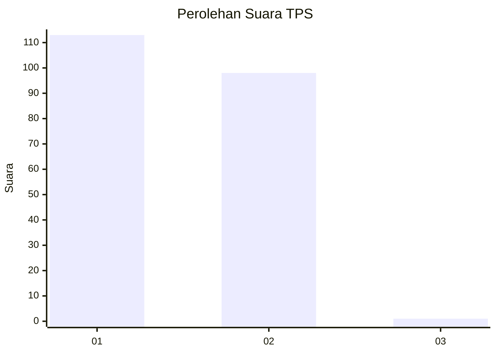
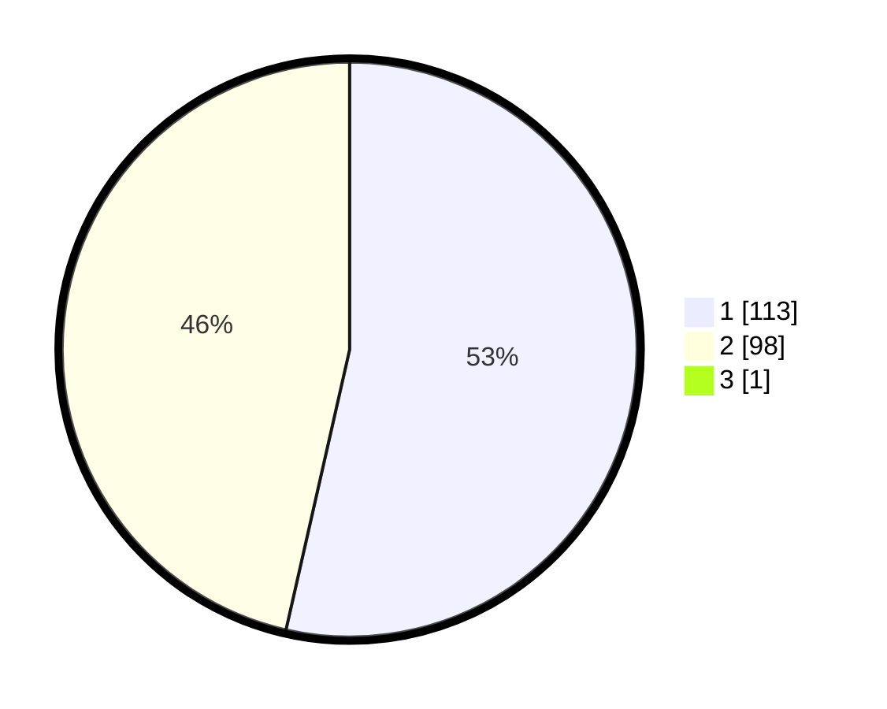

# Hasil

## Grafik

## Tabel

| No. | Nama Paslon    | Suara | Suara (raw) | Persentase |
|:--- |:-------------- | -----:| -----------:| ----------:|
| 1   | ANIES MUHAIMIN | 113   | [113][p-1]  | 53,30      |
| 2   | PRABOWO GIBRAN | 98    | [98][p-2]   | 46,23      |
| 3   | GANJAR MAHFUD  | 1     | [1][p-3]    | 0,47       |

[p-1]: https://github.com/gigit-pemilu/pemilu-2024-14-riau/blob/main/pilpres/hitung-suara/sub/14-riau/sub/72-kota-dumai/sub/06-dumai-kota/sub/1001-laksamana/sub/003-tps/sub/paslon-1.txt
[p-2]: https://github.com/gigit-pemilu/pemilu-2024-14-riau/blob/main/pilpres/hitung-suara/sub/14-riau/sub/72-kota-dumai/sub/06-dumai-kota/sub/1001-laksamana/sub/003-tps/sub/paslon-2.txt
[p-3]: https://github.com/gigit-pemilu/pemilu-2024-14-riau/blob/main/pilpres/hitung-suara/sub/14-riau/sub/72-kota-dumai/sub/06-dumai-kota/sub/1001-laksamana/sub/003-tps/sub/paslon-3.txt

## Foto C Plano

https://sirekap-obj-formc.kpu.go.id/87f7/pemilu/ppwp/14/72/06/10/01/1472061001003-20240215-054413--637fc33b-2050-48bb-b6cf-d7406f4d8602.jpg

https://sirekap-obj-formc.kpu.go.id/87f7/pemilu/ppwp/14/72/06/10/01/1472061001003-20240215-054612--25457b44-7c95-4737-90a8-c07e45a7486e.jpg

https://sirekap-obj-formc.kpu.go.id/87f7/pemilu/ppwp/14/72/06/10/01/1472061001003-20240215-054803--3caf816c-cb3d-4964-bbf8-962bcddd5f77.jpg

## Metadata

| Key        | Value               |
| ---------- | ------------------- |
| Time Stamp | 2024-02-21 02:00:00 |

