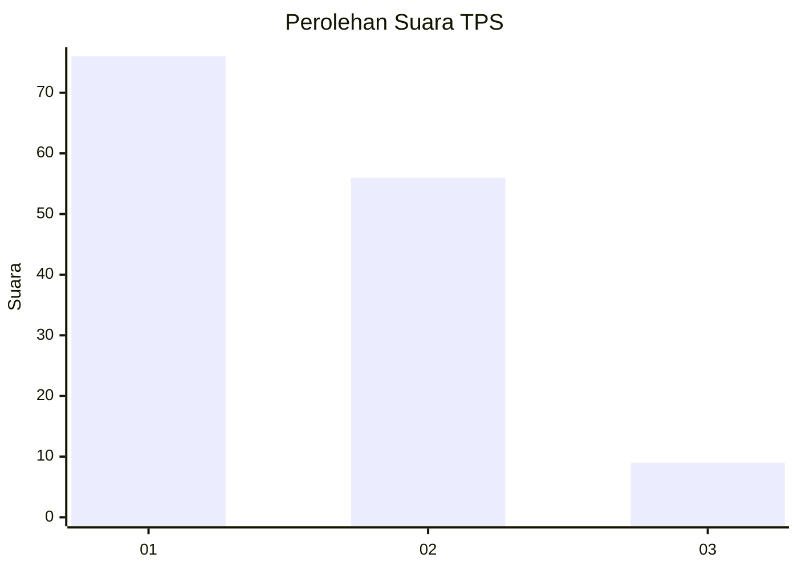
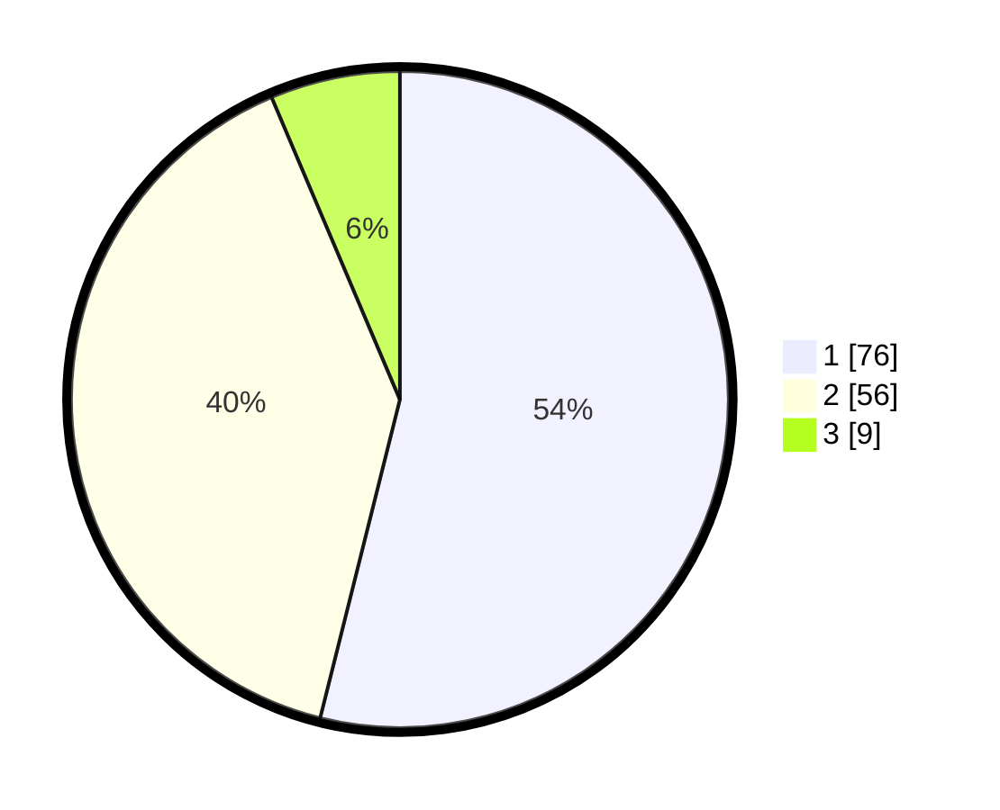

# Hasil

## Grafik

## Tabel

| No. | Nama Paslon    | Suara | Suara (raw) | Persentase |
|:--- |:-------------- | -----:| -----------:| ----------:|
| 1   | ANIES MUHAIMIN | 76    | [76][p-1]   | 53,90      |
| 2   | PRABOWO GIBRAN | 56    | [56][p-2]   | 39,72      |
| 3   | GANJAR MAHFUD  | 9     | [9][p-3]    | 6,38       |

[p-1]: https://github.com/gigit-pemilu/pemilu-2024-14-riau/blob/main/pilpres/hitung-suara/sub/14-riau/sub/72-kota-dumai/sub/06-dumai-kota/sub/1004-bintan/sub/012-tps/sub/paslon-1.txt
[p-2]: https://github.com/gigit-pemilu/pemilu-2024-14-riau/blob/main/pilpres/hitung-suara/sub/14-riau/sub/72-kota-dumai/sub/06-dumai-kota/sub/1004-bintan/sub/012-tps/sub/paslon-2.txt
[p-3]: https://github.com/gigit-pemilu/pemilu-2024-14-riau/blob/main/pilpres/hitung-suara/sub/14-riau/sub/72-kota-dumai/sub/06-dumai-kota/sub/1004-bintan/sub/012-tps/sub/paslon-3.txt

## Foto C Plano

https://sirekap-obj-formc.kpu.go.id/ce4b/pemilu/ppwp/14/72/06/10/04/1472061004012-20240214-225020--ae1f0d8b-6bda-479a-8957-751e85c1c3ac.jpg

https://sirekap-obj-formc.kpu.go.id/ce4b/pemilu/ppwp/14/72/06/10/04/1472061004012-20240215-064440--6397d357-22e2-49fa-86ae-fc3baaf0e549.jpg

https://sirekap-obj-formc.kpu.go.id/ce4b/pemilu/ppwp/14/72/06/10/04/1472061004012-20240215-064814--35c71772-c28b-4169-9529-f790c0ed1e7e.jpg

## Metadata

| Key        | Value               |
| ---------- | ------------------- |
| Time Stamp | 2024-02-25 00:00:00 |

