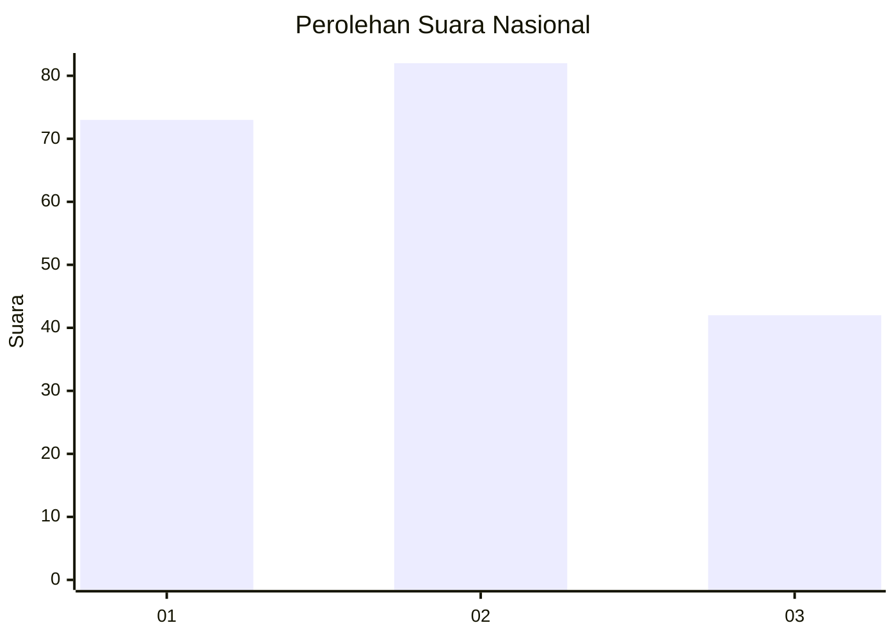
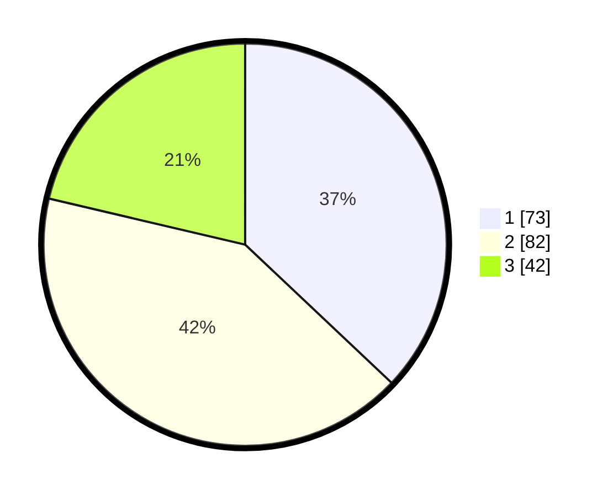

# Hasil

## Grafik

## Tabel

| No. | Nama Paslon    | Suara | Suara (raw) | Persentase |
|:--- |:-------------- | -----:| -----------:| ----------:|
| 1   | ANIES MUHAIMIN | 73    | [73][p-1]   | 37,06      |
| 2   | PRABOWO GIBRAN | 82    | [82][p-2]   | 41,62      |
| 3   | GANJAR MAHFUD  | 42    | [42][p-3]   | 21,32      |

[p-1]: https://github.com/gigit-pemilu/pemilu-2024/blob/main/pilpres/hitung-suara/sub/14-riau/sub/72-kota-dumai/sub/07-dumai-selatan/sub/1001-ratu-sima/sub/004-tps/sub/paslon-1.txt
[p-2]: https://github.com/gigit-pemilu/pemilu-2024/blob/main/pilpres/hitung-suara/sub/14-riau/sub/72-kota-dumai/sub/07-dumai-selatan/sub/1001-ratu-sima/sub/004-tps/sub/paslon-2.txt
[p-3]: https://github.com/gigit-pemilu/pemilu-2024/blob/main/pilpres/hitung-suara/sub/14-riau/sub/72-kota-dumai/sub/07-dumai-selatan/sub/1001-ratu-sima/sub/004-tps/sub/paslon-3.txt

## Foto C Plano

https://sirekap-obj-formc.kpu.go.id/8057/pemilu/ppwp/14/72/07/10/01/1472071001004-20240215-033022--f8135e1f-0afb-4bac-9e7b-2f833f1d4b27.jpg

https://sirekap-obj-formc.kpu.go.id/8057/pemilu/ppwp/14/72/07/10/01/1472071001004-20240215-033140--80c616f0-d464-4e89-9aaf-24dc6170c9b1.jpg

https://sirekap-obj-formc.kpu.go.id/8057/pemilu/ppwp/14/72/07/10/01/1472071001004-20240215-033309--da1a6143-b927-42dd-aea7-435fcbf60844.jpg

## Metadata

| Key        | Value               |
| ---------- | ------------------- |
| Time Stamp | 2024-02-21 18:00:00 |

