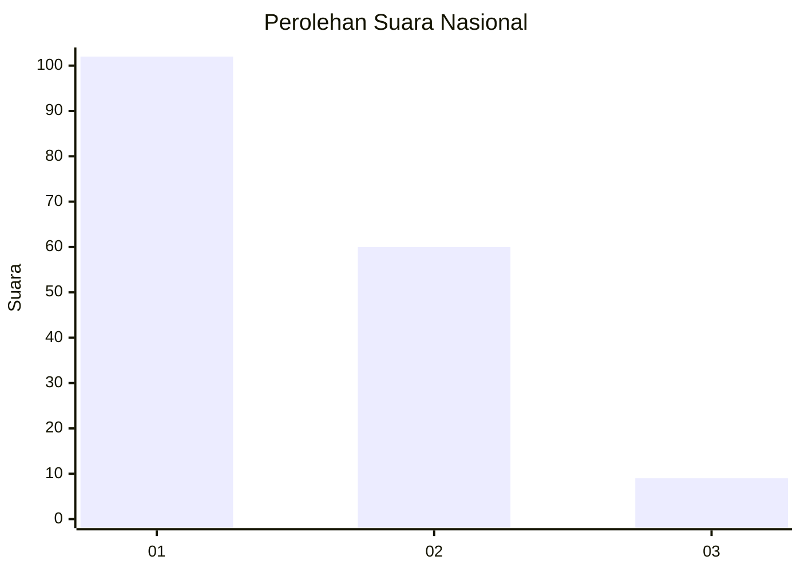
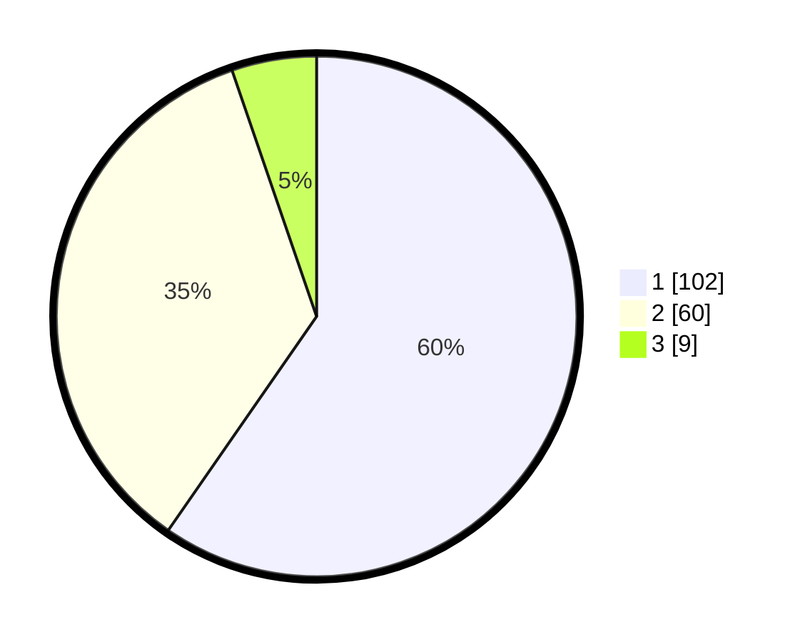

# Hasil

## Grafik

## Tabel

| No. | Nama Paslon    | Suara | Suara (raw) | Persentase |
|:--- |:-------------- | -----:| -----------:| ----------:|
| 1   | ANIES MUHAIMIN | 102   | [102][p-1]  | 59,65      |
| 2   | PRABOWO GIBRAN | 60    | [60][p-2]   | 35,09      |
| 3   | GANJAR MAHFUD  | 9     | [9][p-3]    | 5,26       |

[p-1]: https://github.com/gigit-pemilu/pemilu-2024/blob/main/pilpres/hitung-suara/sub/14-riau/sub/72-kota-dumai/sub/07-dumai-selatan/sub/1002-bukit-timah/sub/003-tps/sub/paslon-1.txt
[p-2]: https://github.com/gigit-pemilu/pemilu-2024/blob/main/pilpres/hitung-suara/sub/14-riau/sub/72-kota-dumai/sub/07-dumai-selatan/sub/1002-bukit-timah/sub/003-tps/sub/paslon-2.txt
[p-3]: https://github.com/gigit-pemilu/pemilu-2024/blob/main/pilpres/hitung-suara/sub/14-riau/sub/72-kota-dumai/sub/07-dumai-selatan/sub/1002-bukit-timah/sub/003-tps/sub/paslon-3.txt

## Foto C Plano

https://sirekap-obj-formc.kpu.go.id/6307/pemilu/ppwp/14/72/07/10/02/1472071002003-20240214-192930--c890a74b-38c3-4308-9e06-3fcf34cc5aa1.jpg

https://sirekap-obj-formc.kpu.go.id/6307/pemilu/ppwp/14/72/07/10/02/1472071002003-20240214-192947--76bdfb6b-4854-445f-b409-e8d6464f20b4.jpg

https://sirekap-obj-formc.kpu.go.id/6307/pemilu/ppwp/14/72/07/10/02/1472071002003-20240214-231522--55fbd5f9-520a-4d65-8a89-2372f5d5fe9b.jpg

## Metadata

| Key        | Value               |
| ---------- | ------------------- |
| Time Stamp | 2024-02-15 01:47:43 |

