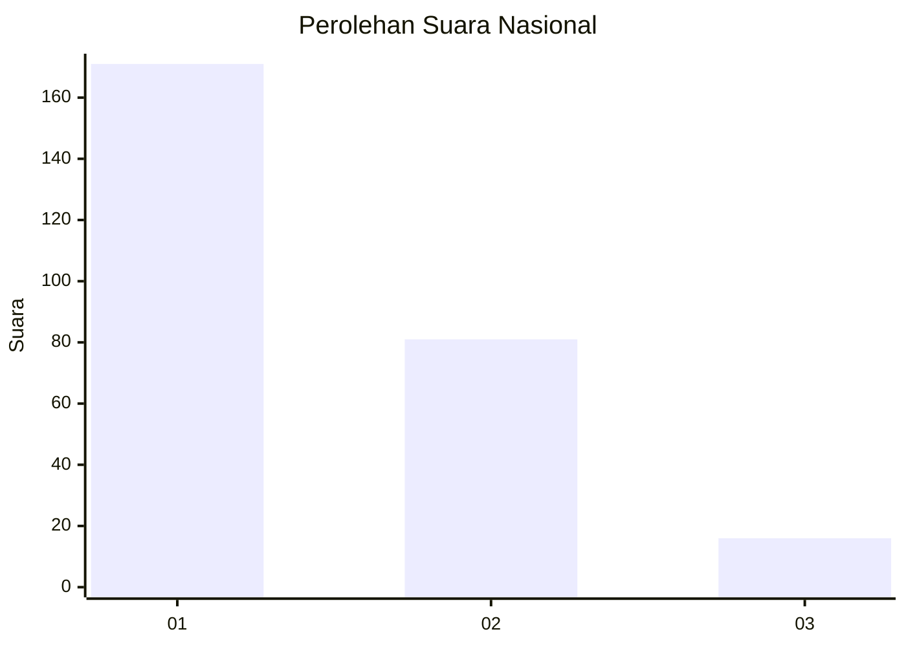
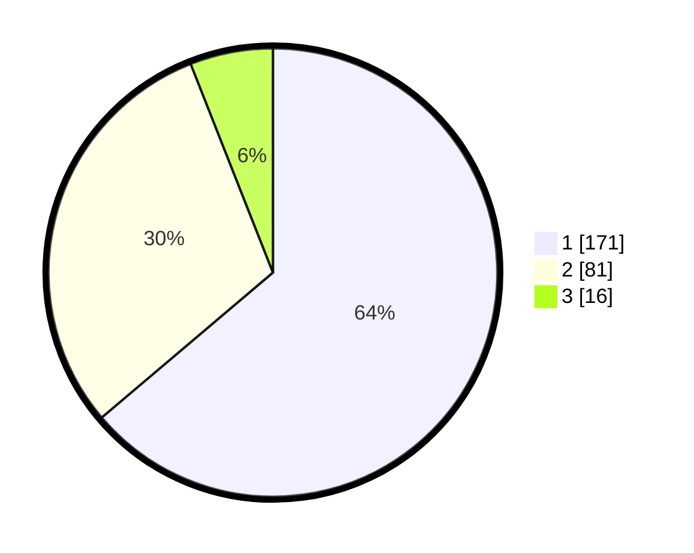

# Hasil

## Grafik

## Tabel

| No. | Nama Paslon    | Suara | Suara (raw) | Persentase |
|:--- |:-------------- | -----:| -----------:| ----------:|
| 1   | ANIES MUHAIMIN | 171   | [171][p-1]  | 63,81      |
| 2   | PRABOWO GIBRAN | 81    | [81][p-2]   | 30,22      |
| 3   | GANJAR MAHFUD  | 16    | [16][p-3]   | 5,97       |

[p-1]: https://github.com/gigit-pemilu/pemilu-2024/blob/main/pilpres/hitung-suara/sub/14-riau/sub/72-kota-dumai/sub/07-dumai-selatan/sub/1002-bukit-timah/sub/011-tps/sub/paslon-1.txt
[p-2]: https://github.com/gigit-pemilu/pemilu-2024/blob/main/pilpres/hitung-suara/sub/14-riau/sub/72-kota-dumai/sub/07-dumai-selatan/sub/1002-bukit-timah/sub/011-tps/sub/paslon-2.txt
[p-3]: https://github.com/gigit-pemilu/pemilu-2024/blob/main/pilpres/hitung-suara/sub/14-riau/sub/72-kota-dumai/sub/07-dumai-selatan/sub/1002-bukit-timah/sub/011-tps/sub/paslon-3.txt

## Foto C Plano

https://sirekap-obj-formc.kpu.go.id/57f7/pemilu/ppwp/14/72/07/10/02/1472071002011-20240215-084658--3f0c659c-232f-4960-9a53-c93b2538bc97.jpg

https://sirekap-obj-formc.kpu.go.id/57f7/pemilu/ppwp/14/72/07/10/02/1472071002011-20240215-085106--53892e9a-e2dc-44ee-a9c2-81a8189b5afe.jpg

https://sirekap-obj-formc.kpu.go.id/57f7/pemilu/ppwp/14/72/07/10/02/1472071002011-20240215-085249--7f3fc165-095c-4b49-b25e-18f83c57c9de.jpg

## Metadata

| Key        | Value               |
| ---------- | ------------------- |
| Time Stamp | 2024-02-21 18:00:00 |

