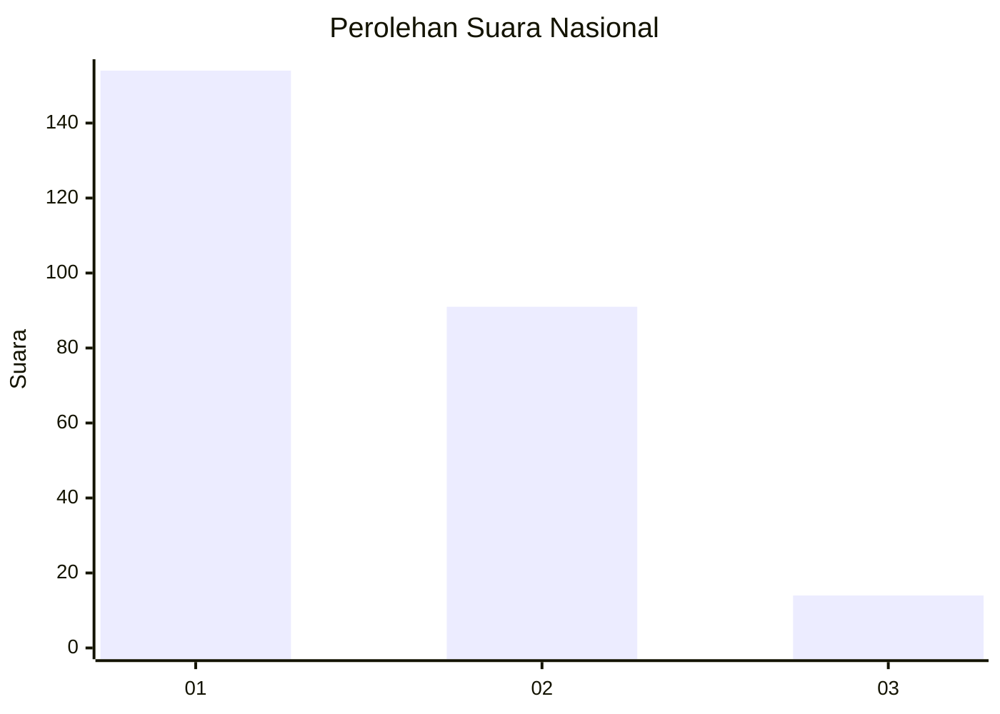
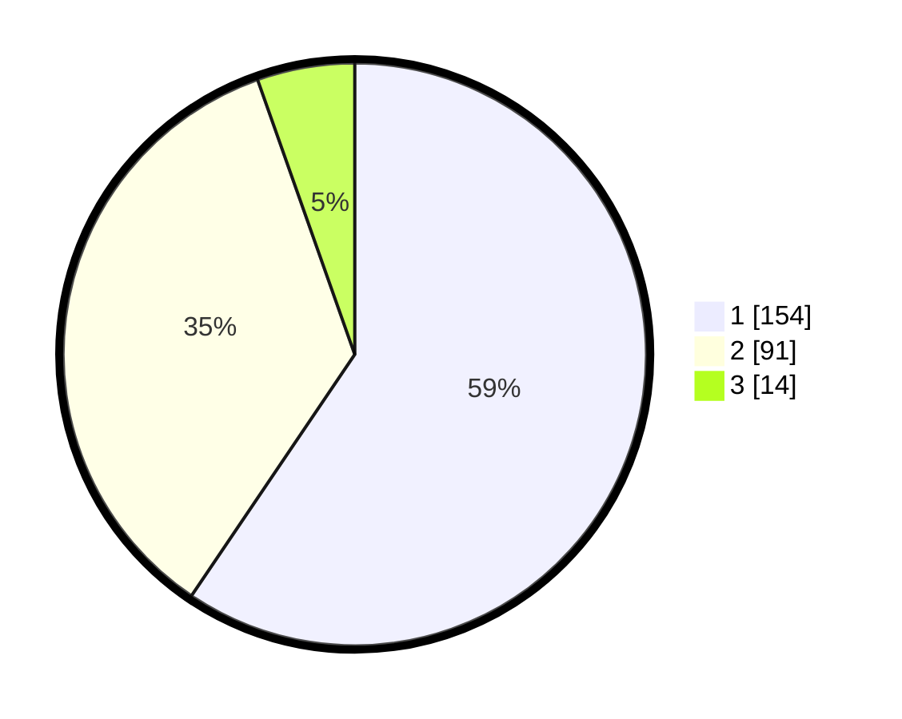

# Hasil

## Grafik

## Tabel

| No. | Nama Paslon    | Suara | Suara (raw) | Persentase |
|:--- |:-------------- | -----:| -----------:| ----------:|
| 1   | ANIES MUHAIMIN | 154   | [154][p-1]  | 59,46      |
| 2   | PRABOWO GIBRAN | 91    | [91][p-2]   | 35,14      |
| 3   | GANJAR MAHFUD  | 14    | [14][p-3]   | 5,41       |

[p-1]: https://github.com/gigit-pemilu/pemilu-2024/blob/main/pilpres/hitung-suara/sub/14-riau/sub/72-kota-dumai/sub/07-dumai-selatan/sub/1002-bukit-timah/sub/020-tps/sub/paslon-1.txt
[p-2]: https://github.com/gigit-pemilu/pemilu-2024/blob/main/pilpres/hitung-suara/sub/14-riau/sub/72-kota-dumai/sub/07-dumai-selatan/sub/1002-bukit-timah/sub/020-tps/sub/paslon-2.txt
[p-3]: https://github.com/gigit-pemilu/pemilu-2024/blob/main/pilpres/hitung-suara/sub/14-riau/sub/72-kota-dumai/sub/07-dumai-selatan/sub/1002-bukit-timah/sub/020-tps/sub/paslon-3.txt

## Foto C Plano

https://sirekap-obj-formc.kpu.go.id/69e7/pemilu/ppwp/14/72/07/10/02/1472071002020-20240215-065108--44166733-47ab-4280-9a03-375224ba5e74.jpg

https://sirekap-obj-formc.kpu.go.id/69e7/pemilu/ppwp/14/72/07/10/02/1472071002020-20240214-201723--5ff8a78c-d7ef-40d5-bf9b-71e48306a810.jpg

https://sirekap-obj-formc.kpu.go.id/69e7/pemilu/ppwp/14/72/07/10/02/1472071002020-20240214-201840--7865e756-fd66-43a9-b4b5-5cce01975779.jpg

## Metadata

| Key        | Value               |
| ---------- | ------------------- |
| Time Stamp | 2024-02-15 21:01:18 |

