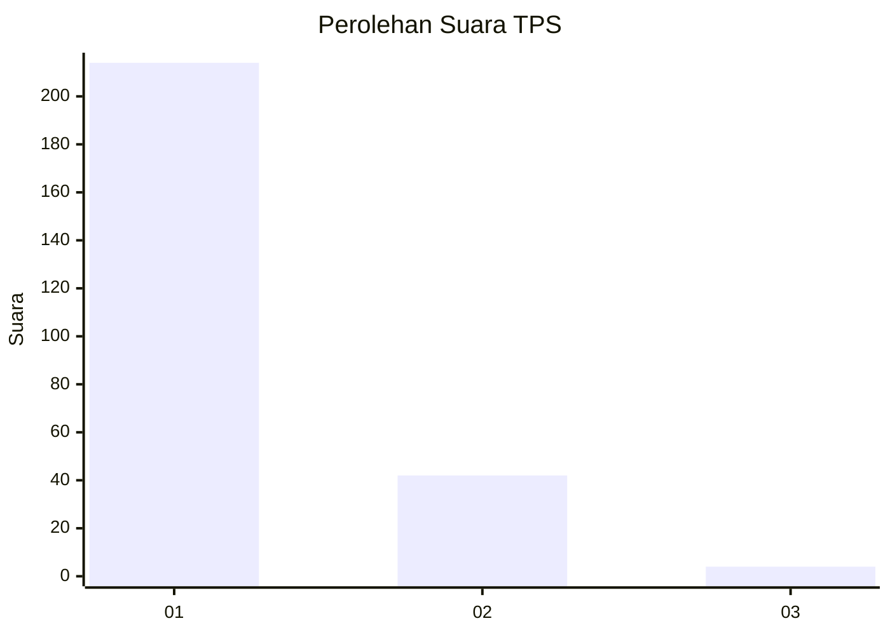
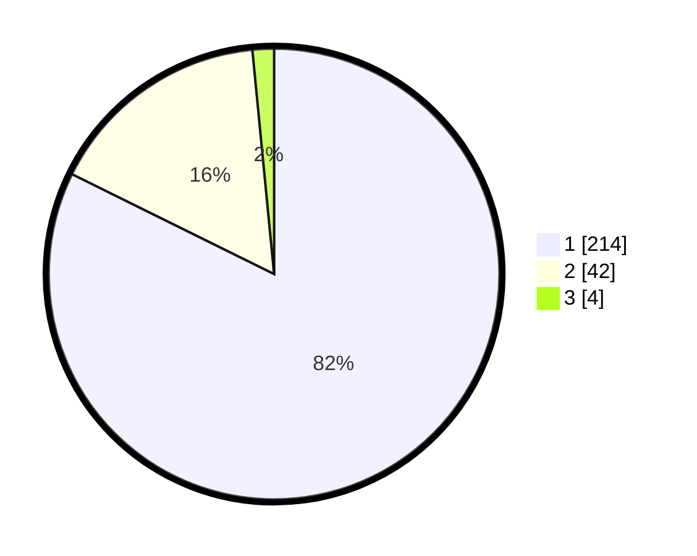

# Hasil

## Grafik

## Tabel

| No. | Nama Paslon    | Suara | Suara (raw) | Persentase |
|:--- |:-------------- | -----:| -----------:| ----------:|
| 1   | ANIES MUHAIMIN | 214   | [214][p-1]  | 82,31      |
| 2   | PRABOWO GIBRAN | 42    | [42][p-2]   | 16,15      |
| 3   | GANJAR MAHFUD  | 4     | [4][p-3]    | 1,54       |

[p-1]: https://github.com/gigit-pemilu/pemilu-2024-14-riau/blob/main/pilpres/hitung-suara/sub/14-riau/sub/72-kota-dumai/sub/07-dumai-selatan/sub/1004-bukit-datuk/sub/019-tps/sub/paslon-1.txt
[p-2]: https://github.com/gigit-pemilu/pemilu-2024-14-riau/blob/main/pilpres/hitung-suara/sub/14-riau/sub/72-kota-dumai/sub/07-dumai-selatan/sub/1004-bukit-datuk/sub/019-tps/sub/paslon-2.txt
[p-3]: https://github.com/gigit-pemilu/pemilu-2024-14-riau/blob/main/pilpres/hitung-suara/sub/14-riau/sub/72-kota-dumai/sub/07-dumai-selatan/sub/1004-bukit-datuk/sub/019-tps/sub/paslon-3.txt

## Foto C Plano

https://sirekap-obj-formc.kpu.go.id/64a2/pemilu/ppwp/14/72/07/10/04/1472071004019-20240215-004047--298cea7b-dfb5-4f54-b13c-7629e80e9206.jpg

https://sirekap-obj-formc.kpu.go.id/64a2/pemilu/ppwp/14/72/07/10/04/1472071004019-20240214-220507--bedea498-ae29-4232-90be-d3c1aaf3c0d3.jpg

https://sirekap-obj-formc.kpu.go.id/64a2/pemilu/ppwp/14/72/07/10/04/1472071004019-20240214-220147--1ab039f4-4c32-4df7-8c0d-8e7858591b77.jpg

## Metadata

| Key        | Value               |
| ---------- | ------------------- |
| Time Stamp | 2024-02-21 02:00:00 |

