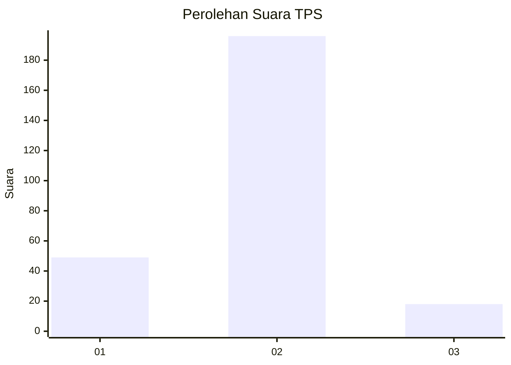
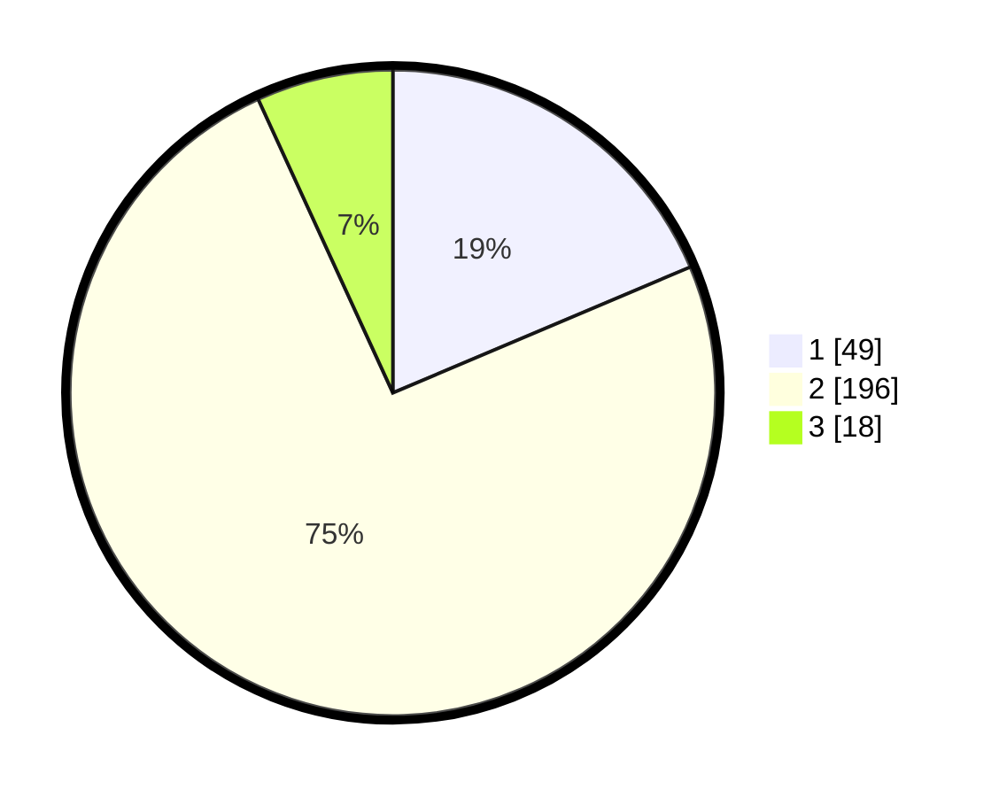

# Hasil

## Grafik

## Tabel

| No. | Nama Paslon    | Suara | Suara (raw) | Persentase |
|:--- |:-------------- | -----:| -----------:| ----------:|
| 1   | ANIES MUHAIMIN | 49    | [49][p-1]   | 18,63      |
| 2   | PRABOWO GIBRAN | 196   | [196][p-2]  | 74,52      |
| 3   | GANJAR MAHFUD  | 18    | [18][p-3]   | 6,84       |

[p-1]: https://github.com/gigit-pemilu/pemilu-2024-14-riau/blob/main/pilpres/hitung-suara/sub/14-riau/sub/72-kota-dumai/sub/07-dumai-selatan/sub/1005-bumi-ayu/sub/903-tps/sub/paslon-1.txt
[p-2]: https://github.com/gigit-pemilu/pemilu-2024-14-riau/blob/main/pilpres/hitung-suara/sub/14-riau/sub/72-kota-dumai/sub/07-dumai-selatan/sub/1005-bumi-ayu/sub/903-tps/sub/paslon-2.txt
[p-3]: https://github.com/gigit-pemilu/pemilu-2024-14-riau/blob/main/pilpres/hitung-suara/sub/14-riau/sub/72-kota-dumai/sub/07-dumai-selatan/sub/1005-bumi-ayu/sub/903-tps/sub/paslon-3.txt

## Foto C Plano

https://sirekap-obj-formc.kpu.go.id/60a4/pemilu/ppwp/14/72/07/10/05/1472071005903-20240214-202306--6da7bde8-2a3b-4b28-b1cb-827aa6277afc.jpg

https://sirekap-obj-formc.kpu.go.id/60a4/pemilu/ppwp/14/72/07/10/05/1472071005903-20240214-202829--902365e0-d787-4efe-b13f-bb7c010bf7d7.jpg

https://sirekap-obj-formc.kpu.go.id/60a4/pemilu/ppwp/14/72/07/10/05/1472071005903-20240214-203125--b69a82ec-3c29-4dbd-897e-ad7a765084c5.jpg

## Metadata

| Key        | Value               |
| ---------- | ------------------- |
| Time Stamp | 2024-02-21 18:00:00 |

